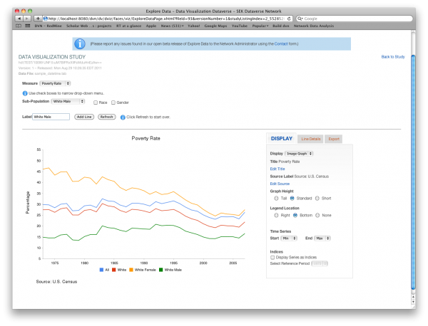

====================================
User Guide
====================================

Common Tasks
++++++++++++++++++

Here is a list of the most common ways people use the Dataverse Network.
Activities can be grouped into finding and using data or publishing
data. A brief description of each activity follows with more detailed
information available in the Users Guide.

Finding Data
===============

Visitors to the site can browse dataverses looking for data of
interest or they can search by keywords. There are Basic and Advanced
Searches.

**Browsing the Site**

The Network Homepage presents a list of recently released dataverses on the left side of the page.  
A dataverse is a container for studies that can be managed as a group by the dataverse administrator. 
Most often a dataverse represents a single organization or scholar and so their studies are often related. 
On the right side of the page there are lists of both recently released studies and studies that have been 
downloaded most often.  At the bottom of these lists, the View More link brings the user to a complete list 
of released dataverses or studies as applicable.  The home page also includes a scrolling list of datverse 
collections called subnetworks, if applicable.

Clicking on the name of a dataverse, study or subnetwork displays its home page.

**Browsing Dataverses**

If you click the View More link under the recently released dataverse list on the Network Homepage you'll be brought to 
the Browse Dataverses page.  Here you can sort the dataverses by Name, Affiliation, Release Date and Download Count.  You 
may also filter the dataverses by typing a filter term in the "filter" text box.  The filter will only display those 
dataverses whose name or affiliation matches the filter term.  Clicking on the name of a dataverse displays its home page.

**Search**

For many purposes, Basic Search is sufficient. On the center top of the network homepage enter keywords or
complete sentences and click **Search**. A resulting list of studies is
displayed. Further refinement can be made by clicking facets such as
"Original Dataverse" or "Author" under "Refine Results" on the left side
of the page. After a facet has been clicked, it will appear at the top
of the page under "Search Results for" and clicking the selected facet
will remove it, restoring the previous results. In addition to the
network homepage, Basic Search can be found on the upper right of the
dataverse home pages as well as on the search results and Advanced
Search pages.  Be aware that searching from a dataverse limits the scope
of search to studies within that dataverse while searching from the
network home page searches all released studies.

When a more specific search is needed, use Advanced Search. Advanced
Search allows searching on keywords found in specific cataloging
information fields, in particular collections in a dataverse where
available, or by variable name. The link to Advanced Search is next to
the Basic Search feature on the network and dataverse home pages and the
search results page.

Using Data
==============

Data in the Dataverse Network is stored in files. Files of any
type are allowed but some types of tabular and network data files are
supported by additional functionality, including downloading in
different formats, downloading subsets of variables, and analytical
tools.

**Download Files**

To download files, click on a study of interest, then select the
data tab. Individual files can be downloaded or groups of files by
checking files of interest or entire file categories and clicking
Download All Selected Files. Groups of files are packaged into a single
``.zip`` file. Group downloads have a download size limit and any selected
files not downloaded will be indicated in the ``.zip`` file.

Downloading individual files in an alternate format where available is
straightforward. Choose the format from the Download As select box next
to the file and the file will download.

**Subset or Analyze Files**

Tabular and Network data files of recognized formats (Stata, SPSS, RData,
Graphml) can be further manipulated through downloading subsets of
variables and by performing various statistical analyses. Where
available these options appear as an additional link, Access
Subset/Analysis, below the Download As format select box next to each
file. The functionality is quite different for tabular versus network
data files so refer to the Users Guide for additional information.

Publishing Data
====================

Publishing data through the Dataverse Network is straightforward:
create an account and a place to store your data, organize your data,
upload files, and release your data for public access.

**Create a Dataverse and Account**

The first step to publishing your data is to create a place to
store it that can be managed by you. To do this you need an account.
Create a dataverse and account by clicking on the Create a Dataverse
link on the upper right side of the network homepage. This leads you
through a series of steps at the end of which you will have a dataverse
and user account to manage it.

Newly created dataverses are unreleased and not available for
browsing. Make note of the link to your dataverse at the end of the
process so you can return to it until it becomes released. Another way
to access your unreleased dataverse is to log in, click on your user
name in the upper right of the page, dataverses tab, then the name of
your dataverse.

**Create Studies**

Once you have a user account and a place to store your data, you
need to take the first step toward organizing your data into studies.
Many data have been or will be used to publish a study so this step may
be clear. If not, a study should represent a particular thesis or
inquiry with accompanying data. First, log in with your new user account
and navigate to your dataverse home page. Next, click Options in the
upper right of the page. From there click Create a Study and complete
the form. Most of the fields on the study form are optional -only the
title is required. If you are unsure of what these values should be,
enter a title and these fields can be completed later before releasing
the study.

Be aware that a newly created study is unreleased and not available
for browsing. To access an unreleased study for further editing, click
on Options->Manage Studies and click on your study's name. You can also
click on your username, studies tab, then the study name.

**Upload Files**

Now that you have a place to store and manage your data and a
study to associate it with, you can upload your data and documentation
files. Files are uploaded to a study. Navigate to the study you want to
upload particular files to and click on Add Files on the upper right
side of the page. The add files page requires you to first select a file
type, then browse for the file on your local system. Some file types
undergo additional processing to support extended functionality but if
you are unsure which type to choose, select Other. At this time you can
enter a descriptive Category which can be used to group related files
and a file description. If you are unsure of these values they can be
added later.

Though files are selected individually, several files can be added
to this page at one time. It is recommended to upload only a few files
at a time since this can take some time to complete, depending on file
type.

An alternative to selecting files individually is to first create an
archive of files in ``.zip`` or ``.tar`` format and then select the
appropriate "multiple files" Data Type when uploading your archive. The
zip file or tarball will be unpacked so that the individual files will
be added to the page.

If you upload an SPSS (``.por``, ``.sav``), Stata (``.dta``) or R
(``.RData``) file, your study will be temporarily unavailable for
editing until the additional processing on the file is completed. This
can be brief or take some time depending on the size and complexity of
the file. A message at the top of the file indicates it is unavailable
for editing and an email will be sent when finished to the address you
indicate on the add files page.

**Release Studies**

Once your study is in a state where it's ready to be published or
shared with others, it should be released. This is done either by
clicking Release on the upper right of the study page or by navigating
to your dataverse, clicking Options, Manage Studies, then clicking
release next to the study you want released. Note that releasing a study
fixes the version number. Additional changes to the study will create a
new draft version. The draft can be repeatedly edited without changing
the version number until it is released. At this point your study is
visible within your dataverse. If your dataverse is also released it
will be searchable and viewable by others. If your dataverse is not yet
released, it will only be visible to people with access to your
dataverse.

**Release Dataverse**

Releasing a dataverse makes it appear in the list of dataverses on
the network home page and makes it viewable by others. This may require
adding a study or other details to your dataverse depending on site
policy. By default, releasing a dataverse requires nothing but changing
the Dataverse Release Settings to Released on the Manage Permissions
page. To release your dataverse, navigate to the dataverse home page,
choose Options from the upper right of the page, click on Dataverse
Settings, then Manage Permissions. At the top of the page, change
Dataverse Release Settiings to Released and click Save Changes.

Any studies that are released are now visible to others. Those
that are unreleased do not appear in the list of studies on the
dataverse home page.

At this point you have published one or more studies and their data and
made them available for browsing or searching.

Things to Consider, Next Steps
===============================

The above tasks are fundamental activities and may be all that is
needed for most users. Some situations are more complex and require
additional consideration. These include publishing and organizing data
for large organizations, shared research between scholars, and enabling
contributions by a geographically diverse team while keeping data
private until ready for publication.

For **large organizations**, a single dataverse may suffice. Collections
within a dataverse can further organize studies by sub unit or topic.
The dataverse itself can be **customized** with the organizations own
website header and footer. In some cases, sub units or organizations
want to maintain their own distinct branding. In such cases each can
create and maintain their own dataverse and the parent dataverse can
link to their studies through a link collection.

For **shared research**, the model is similar: a single dataverse based
on the research project can be created to which both researchers have
administration rights. Additionally, researchers can maintain their own
dataverses for other work and link back to the studies in the shared
project dataverse.

**Allowing a diverse team to contribute** to an unreleased dataverse is
simply a matter of granting the appropriate level of **permissions** to
each team member. At minimum, each team member would need to be added as
a contributor to the dataverse. By default, they can only contribute to
studies they themselves have created. However, this can be expanded from
the dataverse Manage Permissions page to allow contributors to edit all
studies in the dataverse. Changes made by contributors need to be
approved by a curator or admin before a study can be released.

How the Guides Are Organized
============================

The guides are reference documents that explain how to use
the Dataverse Network functionality: Installers Guide, Developers Guide, APIs Guide, and Users
Guide. The Users Guide is further divided into primary activities: using
data, creating studies, administering dataverses or the network. Details
on all of the above tasks can be found in the Users Guide. The
Installers Guide is for people or organizations who want to host their
own Dataverse Network. The Developers Guide contains instructions for
people who want to contribute to the Open Source Dataverse Network
project or who want to modify the code to suit their own needs. Finally, the 
APIs Guide is for people who would like to use our APIs in order to build apps that 
can work with the Dataverse Network web application. This `page <http://thedata.org/book/apps>`__ lists some current apps
which have been developed with our APIs.

Other Resources
=========================

**Dataverse Network Project Site**

Additional information about the Dataverse Network project itself
including presentations, information about upcoming releases, data
management and citation, and announcements can be found at
`http://thedata.org <http://thedata.org/>`__

**User Group**

As the user community grows we encourage people to shares ideas, ask
questions, or offer suggestions for improvement. Go to
`https://groups.google.com/group/dataverse-community <https://groups.google.com/group/dataverse-community>`__ to register to our dataverse community group.

**Follow Us on Twitter**

For up to date news, information and developments, follow our twitter account: `https://twitter.com/thedataorg <https://twitter.com/thedataorg>`__

**Support**

We maintain an email based support service that's free of charge. We
attempt to respond within one business day to all questions and if it
cannot be resolved immediately, we'll let you know what to expect.

Contact Us
=======================

The support email address is
`support@thedata.org <mailto:support@thedata.org>`__.

This is the same address as the Report Issue link. We try to respond
within one business day.

.. _finding-and-using-data:

Finding and Using Data
+++++++++++++++++++++++

Ends users, without need to login to the Dataverse Network, can browse
dataverses, search studies, view study description and data files for
public studies, and subset, analyze and visualize data for public data
files. If entire studies or individual data files are restricted, end
users need to be given permission from the dataverse administrator to
access the data.

Search
=======

To find a study or data set, you can search or browse studies offered
in any released dataverse on the Network homepage. Each dataverse offers
a hierarchical organization comprising one or more collections of data
sets with a particular theme. Most dataverses allow you to search for
data within their files, or you can start browsing through the dataverse
classifications that are closest to your substantive interests.

**Browse Collections**

You can browse all public dataverses from the Network homepage. Click
the title of a dataverse to browse that dataverse's collections and
studies. Click the title of a collection to view a list of studies and
subcollections for that selection. Click the title of a study to view
the Cataloging Information and study files for that selection.

When you select a dataverse to view its contents, the homepage opens to
the \ *root collection*, and the dataverse's studies are displayed
directly under the root collection name. If the root collection contains
other collections, then those collections are listed and not the studies
within them. You must select a collection title to view the studies
contained within it.

Note: If a dataverse includes links to collections from another
dataverse and the root collection does not contain other collections,
the homepage opens to a list of the root and linked collections.

**Search - Basic**

You can search for studies across the entire Dataverse Network from the
Network homepage, or search within a dataverse from the dataverse
homepage. When you search across the Network, studies from restricted
dataverses are not included in the search. Restricted studies are
included in search results, and a lock icon appears beside those studies
in the results list. After your search is complete, you can further
narrow your list of data by searching again in the results. See Search
Tips for search examples and guidelines.

When you enter more than one term in the search text field, the results
list contains studies that have these terms near each other within the
study fields searched. For example, if you enter ``United Nations``,
the results include studies where the words *United* and *Nations* are
separated by no more than four words in the same study field, such as
abstract or title.

It supports a search in any field of the studies' Cataloging
Information, which includes citation information, abstract and other
scope-related information, methodology, and Terms of Use. In addition,
file descriptions also are searched.

**Search - Advanced**

In an advanced search, you can refine your criteria by choosing which
Cataloging Information fields to search. You also can apply logic to the
field search. For text fields, you can specify that the field searched
either *contains* or *does not contain\ the text that you enter. For
date fields, you can specify that the field searched is either *later
than* nor *earlier than* the date that you enter. Refer to
the `Documentation <http://lucene.apache.org/java/docs/>`__  page for
the latest version at the Lucene website and look for *Query Syntax* for full details.

To perform an advanced search, click the Advanced Search link at the
top-right of the Search panel. You can search the following study
metadata fields by using the Search Scope drop-down list:

-  Title - Title field of studies' Cataloging Information.
-  Author - Author fields of studies' Cataloging Information.
-  (Study) Global ID - ID assigned to studies.
-  Other ID - A different ID previously given to the study by another
   archive.
-  Abstract - Any words in the abstract of the study.
-  Keyword - A term that defines the nature or scope of a study. For
   example, ``elections``.
-  Keyword Vocabulary - Reference to the standard used to define the
   keywords.
-  Topic Classification - One or more words that help to categorize the
   study.
-  Topic Classification Vocabulary - Reference used to define the Topic
   Classifications.
-  Producer - Institution, group, or person who produced the study.
-  Distributor - Institution that is responsible for distributing the
   study.
-  Funding Agency - Agency that funded the study.
-  Production Date - Date on which the study was created or completed.
-  Distribution Date - Date on which the study was distributed to the
   public.
-  Date of Deposit - Date on which the study was uploaded to the
   Network.
-  Time Period Cover Start - The beginning of the period covered by the
   study.
-  Time Period Cover End - The end of the period covered by the study.
-  Country/Nation - The country or countries where the study took place.
-  Geographic Coverage - The geographical area covered by the study. For
   example, ``North America``.
-  Geographic Unit - The smallest geographic unit in which the study
   took place, such as ``state``.
-  Universe - Universe of interest, population of interest, or target
   population.
-  Kind of Data - The type of data included in the file, such
   as ``survey data``, ``census/enumeration data``,
   or ``aggregate data``.
-  Variable Information - The variable name and description in the
   studies' data files, given that the data file is subsettable and
   contains tabular data. It returns the studies that contain the file
   and the variable name where the search term was found.

**Sort Results**

When your search is complete, the results page lists studies that met
the search criteria in order of relevance. For example, a study that
includes your search term within the Cataloging Information in ten
places appears before a study that includes your search term in the
Cataloging Information in only one place.

You can sort search results by title, study ID, last updated, or number
of downloads (that is, the number of times users downloaded any file
belonging to that study). Click the Sort By drop-down list to choose
your sort order.

**Search Tips**

Use the following guidelines to search effectively within a Network or a
dataverse:

-  The default search syntax uses ``AND`` logic within individual
   fields. That is, if you enter more than one term, the search engine
   looks for all terms within a single field, such as title or abstract.
   For example, if you enter ``United Nations report``, the results
   list any studies that include the terms *United*, *Nations*,
   and *report* within a single metadata field.
-  The search logic looks for multiple terms within a specific proximity
   to one another, and in the same field. The current proximity criteria
   is four words. That is, if you enter two search terms, both terms
   must be within four words of each other in the same field to be
   returned as a result.
   For example, you might enter ``10 year`` in a basic search. If a
   study includes the string *10 millions deaths per year* within a
   metadata field, such as abstract, that study is not included in the
   search results. A study that contains the string *10 per year* within the abstract field is included in the search results.
-  During the index process that supports searches, periods are removed
   in strings and each term between periods is indexed individually. If
   you perform a basic search for a term that contains one or more
   periods, the search works because the analyzer applies
   the *AND* logic. If you search on a specific field, though, note
   that you should specify individually each component of the string
   between periods to return your results.
-  You can enter one term in the search field, and then search within
   those results for another term to narrow the results further. This
   might be more effective than searching for both terms at one time, if
   those terms do not meet the proximity and field limits specified
   previously.
   You could search first for an author's name, and then search those
   results for a specific term in the title. If you try searching for
   both terms in the author and title fields together, you might not
   find the study for which you are looking.
   For example, you can search the Harvard Dataverse Network for the
   following study:

       *Gary King; Will Lowe, 2003, "10 Million International Dyadic
       Events", hdl:1902.1/FYXLAWZRIA UNF:3:um06qkr/1tAwpS4roUqAiw==
       Murray Research Archive [Distributor]*

   If you type ``King, 10 Million`` in the Search field and click
   Search, you see ``0 matches were found`` in the Results field. If
   you type ``10`` in the Search field and click Search, you see
   something like ``1621 matches were found`` in the Results field.
   But if you first type ``King`` in the Search field and click
   Search, then type ``10 Million`` in the Search field and click
   Search again, you see something like ``4 matches were found`` in the
   Results field.

View Studies / Download Data
============================

**Cataloging Information**

When a study is created, a set of *metadata* is associated with that
study. This metadata is called the *Cataloging Information* for the
study. When you select a study to view it, you first see the Cataloging
Information tab listing the metadata associated with that study. This is
the default view of a study.

Cataloging Information contains numerous fields that help to describe
the study. The amount of information you find for each study varies,
based on what was entered by the author (Contributor) or Curator of that
study. For example, one study might display the distributor, related
material, and geographic coverage. Another study might display only the
authors and the abstract. Every study includes the *Citation Information* fields in the Cataloging Information.

Note: A comprehensive list of all Cataloging Information fields is
provided in the :ref:`List of Metadata References <metadata-references>`

Cataloging Information is divided into four sections. These sections and
their details are displayed only when the author (Contributor) or
Curator provides the information when creating the study. Sections
consist of the following:

-  Citation Information - These fields comprise
   the `citation <http://thedata.org/citation>`__ for the study,
   consisting of a global identifier for all studies and a UNF, or
   Universal Numerical Fingerprint, for studies that contain subsettable
   data files. It also can include information about authors, producers
   and distributors, and references to related studies or papers.
-  Abstract and Scope - This section describes the research study, lists
   the study's data sets, and defines the study's geographical scope.
-  Data Collection/Methodology - This section includes the technical
   details of how the author obtained the data.
-  Terms of Use - This information explains that the study requires
   users to accept a set of conditions or agreements before downloading
   or analyzing the data. If any *Terms of Use* text is displayed in
   the Cataloging Information section, you are prompted to accept the
   conditions when you click the download or analyze icons in the Files
   page.
   Note: A study might not contain Terms of Use, but in some cases the
   original parent dataverse might have set conditions for all studies
   owned by that dataverse. In that case, the conditions are inherited
   by the study and you must accept these conditions before downloading
   files or analyzing the data.
   
Study metadata can be downloaded in XML format using a link at the bottom 
of the study Cataloging Information tab:  `DDI (without variables) <https://thedata.harvard.edu/dvn/api/metadata/91148?partialExclude=codeBook/dataDscr>`__
/ `DDI (full) <https://thedata.harvard.edu/dvn/api/metadata/91148>`__. 
These links appear for released studies whose metadata has been exported. 
Studies are typically exported on a daily basis.

**List of Study Files**

When you view a study, click the Documentation, Data and Analysis tab to
view a list of all electronic files associated with the study that were
provided by the author or Curator.

A study might contain documentation, data, or other files. When the
study contributor uploads data files of the type ``.dta``, ``.sav``, or ``.por`` to the Network, those files are converted
to ``.tab`` tab-delimited files. These ``.tab`` files
are subsettable, and can be subsetted and analyzed online by using the Dataverse Network
application.

Data files of the type ``.xml`` also are considered to be subsettable,
and can be subsetted and analyzed to a minimal degree online.
An ``.xml`` type file indicates social network data that complies with
the `GraphML <http://graphml.graphdrawing.org/>`__ file format.

You can identify a subsettable data file by the *Subsetting* label and
the number of cases and variables listed next to the file name. Other
files that also contain data might be associated with a study, but the
Dataverse Network application does not recognize them as data (or
subsettable) files.

**Download Study Files**

You can download any of the following within a study:

-  All or selected data files within a *study* or a *category* (type
   of files)
-  Individual *data files*
-  Individual subsets within a data file (see :ref:`Subset and Analyze
   Tabular Data Sets <tabular-data>`
   or :ref:`Subset and Analyze Network Data Sets <network-data>` for details)

The default format for subsettable tabular data file downloads
is *tab-delimited*. When you download one or more subsettable files in
tab-delimited format, the file contains a header row. When you download
one subsettable file, you can select from the following formats in
addition to tab-delimited:

-  Original file
-  Splus
-  Stata
-  R

The default format for subsettable network data file downloads
is *Original file*. In addition, you can choose to download network
data files in *GraphML* format.

If you select any other format for a tabular data file, the file is
downloaded in a zipped archive. You must unzip the archive to view or
use the individual data file.

If you download all or a selection of data files within a study, the
files are downloaded in a zipped archive, and the individual files are
in tab-delimited or network format. You must unzip the archive to view
or use the individual data files.

Note: Studies and data files often have user restrictions applied. If
prompted to accept Terms of Use for a study or file, check the *I Accept* box and then click the Continue button to view or download the
file.

**User Comments**

If the User Comment feature is enabled within a dataverse, users are
able to add comments about a study within that dataverse.

When you view a study, click the User Comments tab to view all comments
associated with the study. Comments can be monitored and abuse reported
to the Network admin, who has permission to remove any comments deemed
inappropriate. Note that the dataverse admin does not have permission to
remove comments, to prevent bias.

If you choose, you also can add your own comments to a study from the
User Comments tab. See :ref:`Comment on Studies or Data <edit-study-comments-settings>` for
detailed information.

Note: To add a comment to a study, you must register and create an
account in the dataverse that owns the study about which you choose to
comment. This helps to prevent abuse and SPAM issues.

**Versions**

Upon creating a study, a version is created. This is a way to archive
the *metadata* and *data files* associated with the study citation
or UNF.

**View Citations**

You can view a formatted citation for any of the following entities
within the Dataverse Network application:

-  Studies - For every study, you can view a citation for that study.
   Go to the Cataloging Information tab for a study and view the *How
   to Cite* field.
-  Data sets - For any data set, you can view a citation for that set.
   Go to the Documentation, Data and Analysis tab for a study to see the
   list of study files. To view the citation for any data set click
   the *View Data Citation* link associated with that subsettable
   file.
-  Data subsets - If you subset and analyze a data set, you can view a
   citation for each subset. 
   See :ref:`Apply Descriptive Statistics <apply-descriptive-statistics>` or :ref:`Perform Advanced Analysis <perform-advanced-analysis>` for
   detailed information.
   Also, when you download a workspace file, a copy
   of the citation information for that subset is provided in the
   download.

Note: For individual variables within a subsettable data subset, you can
view the `UNF <http://thedata.org/citation/tech>`__ for that variable.
This is not a full citation for the variable, but it is one component of
that citation. Note also that this does not apply to ``.xml`` data.

Subset and Analysis
====================

Subsetting and analysis can be performed on tabular and network data
files. Refer to the appropriate section for more details.

.. _tabular-data:

Tabular Data
--------------

Tabular data files (subsettable files) can be subsetted and analyzed
online by using the Dataverse Network application. For analysis, the
Dataverse Network offers a user interface to Zelig, a powerful, R-based
statistical computing tool. A comprehensive set of Statistical Analysis
Models are provided.

After you find the tablular data set that you want, access the Subset
and Analysis options to use the online tools. Then, you can *subset
data by variables or observations*, translate it into a convenient
format, download subsets, and apply statistics and analysis.

Network data files (also subsettable) can be subsetted online, and then
downloaded as a subset. Note that network data files cannot be analyzed
online.

Review the Tabular Data Subset and Recode Tips before you start.

**Access Subset and Analysis Options**

You can subset and analyze tabular data files before you download the
file or your subsets.

To access the Subset and Analysis options for a data set:

#. Click the title of the study from which you choose to analyze or
   download a file or subset.
#. Click the Documentation, Data and Analysis tab for the study.
#. In the list of study files, locate the data file that you choose to
   download, subset, or analyze.
   You can download data sets for a file only if the file entry includes
   the subset icon.
#. Click the *Access Subset/Analysis* link associated with the
   selected file.
   If prompted, check the *I accept* box and click Continue to accept
   the Terms of Use.
   You see the Data File page listing data for the file that you choose
   to subset or analyze.

**View Variable Quick Summary**

When a subsettable data file is uploaded for a study, the Dataverse
Network code calculates summary statistics for each variable within that
data file. On any tab of the Data File page, you can view the summary
statistics for each variable in the data file. Information listed
comprises the following:

-  For continuous variables, the application calculates summary
   statistics that are listed in the DDI schema.
-  For discrete variables, the application tabulates values and their
   labels as a frequency table.
   Note, however, that if the number of categories is more than 50, the
   values are not tabulated.
-  The UNF value for each variable is included.

To view summary statistics for a variable:

#. In the Data File page, click any tab.
#. In the variable list on the bottom of the page, the right column is
   labeled *Quick Summary*.
   locate a variable for which you choose to view summary statistics.
   Then, click the Quick Summary icon for that variable to toggle the
   statistic's information on and off.
   You see a small chart that lists information about that variable. The
   information provided depends upon the variable selected.

**Download Tabular Subsets**

You can download a subset of variables within a tabular-data study file.
You also can recode a subset of those variables and download the recoded
subset, if you choose.

To download a subset of variables in tabular data:

#. In the Data File page, click the Download Subset tab.
#. Click the radio button for the appropriate File Format in which to
   download the variables: Text, R Data, S plus, or Stata.
#. On the right side of the tab, use the Show drop-down list to select
   the quantities of variables to list at one time: 10, 20, 50, or All.
#. Scroll down the screen and click the check boxes to select variables
   from the table of available values. When you select a variable, it is
   added to the Selected Variables box at the top of the tab.
   To remove a variable from this box, deselect it from the Variable
   Type list at the bottom of the screen.
   To select all variables, click the check box beside the column name,
   Variable Type.
#. Click the *Create Zip File* button.
   The *Create Zip File* button label changes the following
   format: ``zipFile_<number>.zip``.
#. Click the ``zipFile_<number>.zip`` button and follow your browser's
   prompts to open or save the data file to your computer's disk drive

.. _apply-descriptive-statistics:

**Apply Descriptive Statistics**

When you run descriptive statistics for data, you can do any of the
following with the analysis results:

-  Open the results in a new window to save or print the results.
-  Download the R workspace in which the statistics were analyzed, for
   replication of the analysis. See Replicate Analysis for more
   information.
-  View citation information for the data analyzed, and for the full
   data set from which you selected variables to analyze. See View
   Citations for more information.

To apply descriptive statistics to a data set or subset:

#. In the Data File page, click the Descriptive Statistics tab.
#. Click one or both of the Descriptive Statistics options: Univariate
   Numeric Summaries and Univariate Graphic Summaries.
#. On the right side of the tab, use the Show drop-down list to select
   one of the following options to show variables in predefined
   quantities: 10, 20, 50, or All.
#. Scroll down the screen and click the check boxes to select variables
   from the table of available values. When you select a variable, it is
   added to the Selected Variables box at the top of the tab.
   To remove a variable from this box, deselect it from the Variable
   Type list at the bottom of the screen.
   To select all variables, click the check box beside the column name,
   Variable Type.
#. Click the Run Statistics button.
   You see the Dataverse Analysis page.
#. To save or print the results, scroll to the Descriptive Statistics
   section and click the link *Open results in a new window*. You then
   can print or save the window contents.
   To save the analysis, scroll to the Replication section and click the
   button *zipFile_<number>.zip*.
   Review the Citation Information for the data set and for the subset
   that you analyzed.
#. Click the link *Back to Analysis and Subsetting* to return the
   previous page and continue analysis of the data.

**Recode and Case-Subset Tabular Data**

Review the Tabular Data Recode and Subset Tips before you start work
with a study's files.

To recode and subset variables within a tabular data set:

#. In the Data File page, click the Recode and Case-Subsetting tab.
#. One the right side of the variable list, use the Show drop-down list
   and select one of the following options to show variables in
   predefined quantities: 10, 20, 50, or All.
#. Scroll down the screen and click the check boxes to select variables
   from the table of available values. When you select a variable, it is
   added to the Selected Variables box at the top of the tab.
   To remove a variable from this box, deselect it from the Variable
   Type list at the bottom of the screen.
   To select all variables, click the check box beside the column name,
   Variable Type.
#. Select one variable in the Selected Variables box, and then
   click *Start*.
   The existing name and label of the variable appear in the New
   Variable Name and New Variable Label boxes.
#. In the New Variable Label field, change the variable name to a unique
   value that is not used in the data file.
   The new variable label is optional.
#. In the table below the Variable Name fields, you can check one or
   more values to drop them from the subset, or enter new values,
   labels, or ranges (as a condition) as needed. Click the Add
   Value/Range button to create more entries in the value table.
   Note: Click the ``?`` Info buttons to view tips on how to use the
   Recode and Subset table. Also, See Tabular Data Recode and Subset
   Tips for more information about adding values and ranges.
#. Click the Apply Recodes button.
   Your renamed variables appear at the bottom of the page in the List
   of Recode Variables.
#. Select another variable in the Selected Variables box, click the
   Start button, and repeat the recode action.
   Repeat this process for each variable that you choose to recode.
#. To remove a recoded variable, scroll to the List of Recode Variables
   at the bottom of the page and click the Remove link for the recoded
   variable that you choose to delete from your subset.

.. _perform-advanced-analysis:

**Perform Advanced Analysis**

When you run advanced statistical analysis for data, you can do any of
the following with the analysis results:

-  Open the results in a new window to save or print the results.
-  Download the R workspace in which the statistics were analyzed, for
   replication of the analysis. See Replicate Analysis for more
   information.
-  View citation information for the data analyzed, and for the full
   data set from which you selected variables to analyze. See View
   Citations for more information.

To run statistical models for selected variables:

#. In the Data File page, click the Advanced Statistical Analysis tab.
#. Scroll down the screen and click the check boxes to select variables
   from the table of available values. When you select a variable, it is
   added to the Selected Variables box at the top of the tab.
   To remove a variable from this box, deselect it from the Variable
   Type list at the bottom of the screen.
   To select all variables, click the check box beside the column name,
   Variable Type.
#. Select a model from the Choose a Statistical Model drop-down list.
#. Select one variable in the Selected Variables box, and then click the
   applicable arrow button to assign a function to that variable from
   within the analysis model.
   You see the name of the variables in the appropriate function box.
   Note: Some functions allow a specific type of variable only, while
   other functions allow multiple variable types. Types include
   Character, Continuous, and Discrete. If you assign an incorrect
   variable type to a function, you see an ``Incompatible type`` error
   message.
#. Repeat the variable and function assignments until your model is
   complete.
#. Select your Output options.
#. Click the Run Model button.
   If the statistical model that you defined is incomplete, you first
   are prompted to correct the definition. Correct your model, and then
   click Run Model again.
   You see the Dataverse Analysis page.
#. To save or print the results, scroll to the Advanced Statistical
   Analysis section and click the link *Open results in a new window*.
   You then can print or save the window contents.
   To save the analysis, scroll to the Replication section and click the
   button ``zipFile_<number>.zip``.
   Review the Citation Information for the data set and for the subset
   that you analyzed.
#. Click the link *Back to Analysis and Subsetting* to return the
   previous page and continue analysis of the data.

**Replicate Analysis**

You can save the R workspace in which the Dataverse Network performed an
analysis. You can download the workspace as a zipped archive that
contains four files. Together, these files enable you to recreate the
subset analysis in another R environment:

-  ``citationFile.<identifier>.txt`` - The citation for the subset that you analyzed.
-  ``rhistoryFile.<identifier>.R`` - The R code used to perform the analysis.
-  ``tempsubsetfile.<identifier>.tab`` - The R object file used to perform the analysis.
-  ``tmpRWSfile.<identifier>.RData`` - The subset data that you analyzed.

To download this workspace for your analysis:

#. For any subset, Apply Descriptive Statistics or Perform Advanced
   Analysis.
#. On the Dataverse Analysis or Advanced Statistical Analysis page,
   scroll to the Replication section and click the
   button ``zipFile_<number>.zip``.
#. Follow your browser's prompts to save the zipped archive.
   When the archive file is saved to your local storage, extract the
   contents to use the four files that compose the R workspace.

**Statistical Analysis Models**

You can apply any of the following advanced statistical models to all or
some variables in a tabular data set:

Categorical data analysis: Cross tabulation

Ecological inference model: Hierarchical mulitnomial-direct ecological
inference for R x C tables

Event count models, for event count dependent variables:

-  Negative binomial regression
-  Poisson regression

Models for continuous bounded dependent variables:

-  Exponential regression for duration
-  Gamma regression for continuous positives
-  Log-normal regression for duration
-  Weibull regression for duration

Models for continuous dependent variables:

-  Least squares regression
-  Linear regression for left-censoreds

Models for dichotomous dependent variables:

-  Logistic regression for binaries
-  Probit regression for binaries
-  Rare events logistic regression for binaries

Models for ordinal dependent variables:

-  Ordinal logistic regression for ordered categoricals
-  Ordinal probit regression for ordered categoricals

**Tabular Data Recode and Subset Tips**

Use the following guidelines when working with tabular data files:

-  Recoding:

   -  You must fill at least the first (new value) and last (condition)
      columns of the table; the second column is optional and for a new
      value label.
   -  If the old variable you chose for recoding has information about
      its value labels, you can prefill the table with these data for
      convenience, and then modify these prefilled data.
   -  To exclude a value from your recoding scheme, click the Drop check
      box in the row for that value.

-  Subsetting:

   -  If the variable you chose for subsetting has information about its
      value labels, you can prefill the table with these data for
      convenience.
   -  To exclude a value in the last column of the table, click the Drop
      check box in row for that value.
   -  To include a particular value or range, enter it in the last
      column whose header shows the name of the variable for subsetting.

-  Entering a value or range as a condition for subsetting or recoding:

   -  Suppose the variable you chose for recoding is x.
      If your condition is x==3, enter ``3``.
      If your condition is x < -3, enter ``(--3``.
      If your condition is x > -3, enter ``-3-)``.
      If your condition is -3 < x < 3, enter ``(-3, 3)``.
   -  Use square brackets (``[]``) for closed ranges.
   -  You can enter non-overlapping values and ranges separated by a
      comma, such as ``0,[7-9]``.

.. _network-data:

Network Data
--------------

Network data files (subsettable files) can be subsetted and analyzed
online by using the Dataverse Network application. For analysis, the
Dataverse Network offers generic network data analysis. A list of
Network Analysis Models are provided.

Note: All subsetting and analysis options for network data assume a
network with undirected edges.

After you find the network data set that you want, access the Subset and
Analysis options to use the online tools. Then, you can subset data
by *vertices* or *edges*, download subsets, and apply network
measures.

**Access Network Subset and Analyze Options**

You can subset and analyze network data files before you download the
file or your subsets. To access the Subset and Analysis options for a
network data set:

#. Click the title of the study from which you choose to analyze or
   download a file or subset.
#. Click the Documentation, Data and Analysis tab for the study.
#. In the list of study files, locate the network data file that you
   choose to download, subset, or analyze. You can download data sets
   for a file only if the file entry includes the subset icon.
#. Click the \ *Access Subset/Analysis* link associated with the
   selected file. If prompted, check the \ *I accept* box and click
   Continue to accept the Terms of Use.
   You see the Data File page listing data for the file that you choose
   to subset or analyze.

**Subset Network Data**

There are two ways in which you can subset network data. First, you can
run a manual query, and build a query of specific values for edge or
vertex data with which to subset the data. Or, you can select from among
three automatically generated queries with which to subset the data:

-  Largest graph - Subset the <nth> largest connected component of the
   network. That is, the largest group of nodes that can reach one
   another by walking across edges.
-  Neighborhood - Subset the <nth> neighborhood of the selected
   vertices. That is, generate a subgraph of the original network
   composed of all vertices that are positioned at most <n> steps away
   from the currently selected vertices in the original network, plus
   all of the edges that connect them.

You also can successively subset data to isolate specific values
progressively.

Continue to the next topics for detailed information about subsetting a
network data set.

**Subset Manually**

Perform a manual query to slice a graph based on the attributes of its
vertices or edges. You choose whether to subset the graph based on
vertices or edges, then use the Manual Query Builder or free-text Query
Workspace fields to construct a query based on that element's
attributes. A single query can pertain only to vertices or only to
edges, never both. You can perform separate, sequential vertex or edge
queries.

When you perform a vertex query, all vertices whose attributes do not
satisfy the query are dropped from the graph, in addition to all edges
that touch them. When you perform an edge query, all edges whose
attributes do not satisfy the criteria are dropped, but all vertices
remain *unless* you enable the *Eliminate disconnected vertices* check box. Note that enabling this option drops all
disconnected vertices whether or not they were disconnected before the
edge query.

Review the Network Data Tips before you start work with a study's files.

To subset variables within a network data set by using a manually
defined query:

#. In the Data File page, click the Manual Query radio button near the
   top of the page.
#. Use the Attribute Set drop-down list and select Vertex to subset by
   node or vertex values.
   Select Edge to subset by edge values.
#. Build the first attribute selection value in the Manual Query Builder
   panel:

   #. Select a value in the Attributes list to assign values on which to
      subset.
   #. Use the Operators drop-down list to choose the function by which
      to define attributes for selection in this query.
   #. In the Values field, type the specific values to use for selection
      of the attribute.
   #. Click *Add to Query* to complete the attribute definition for
      selection.
      You see the query string for this attribute in the Query Workspace
      field.

   Alternatively, you can enter your query directly by typing it into
   the Query Workspace field.

#. Continue to add selection values to your query by using the Manual
   Query Builder tools.
#. To remove any verticies that do not connect with other data in the
   set, check the \ *Eliminate disconnected vertices* check box.
#. When you complete construction of your query string, click \ *Run* to
   perform the query.
#. Scroll to the bottom of the window, and when the query is processed
   you see a new entry in the Subset History panel that defines your
   query.

Continue to build a successive subset or download a subset.

**Subset Automatically**

Peform an Automatic Query to select a subgraph of the nextwork based on
structural properties of the network. Remember to review the Network
Data Tips before you start work with a study's files.

To subset variables within a network data set by using an automatically
generated query:

#. In the Data File page, click the Automatic Query radio button near
   the middle of the page.
#. Use the Function drop-down list and select the type of function with
   which to select your subset:

   -  Largest graph - Subset the <nth> largest group of nodes that can
      reach one another by walking across edges.
   -  Neighborhood - Generate a subgraph of the original network
      composed of all vertices that are positioned at most <n> steps
      away from the currently selected vertices in the original network,
      plus all of the edges that connect them. This is the only query
      that can (and generally does) increase the number of vertices and
      edges selected.

#. In the Nth field, enter the <nth> degree with which to select data
   using that function.
#. Click \ *Run* to perform the query.
#. Scroll to the bottom of the window, and when the query is processed
   you see a new entry in the Subset History panel that defines your
   query.

Continue to build a successive subset or download a subset.

**Build or Restart Subsets**

**Build a Subset**

To build successive subsets and narrow your data selection
progressively:

#. Perform a manual or automatic subset query on a selected data set.
#. Perform a second query to further narrow the results of your previous
   subset activity.
#. When you arrive at the subset with which you choose to work, continue
   to analyze or download that subset.

**Undo Previous Subset**

You can reset, or undo, the most recent subsetting action for a data
set. Note that you can do this only one time, and only to the most
recent subset.

Scroll to the Subset History panel at the bottom of the page and
click \ *Undo* in the last row of the list of successive subsets.
The last subset is removed, and the previous subset is available for
downloading, further subsetting, or analysis.

**Restart Subsetting**

You can remove all subsetting activity and restore data to the original
set.

Scroll to the Subset History panel at the bottom of the page and
click \ *Restart* in the row labeled \ *Initial State*.
The data set is restored to the original condition, and is available
for downloading, subsetting, or analysis.

**Run Network Measures**

When you finish selecting the specific data that you choose to analyze,
run a Network Measure analysis on that data. Review the Network Data
Tips before you start your analysis.

#. In the Data File page, click the Network Measure radio button near
   the bottom of the page.
#. Use the Attributes drop-down list and select the type of analysis to
   perform:

   -  Page Rank - Determine how much influence comes from a specific
      actor or node.
   -  Degree - Determine the number of relationships or collaborations
      exist within a network data set.
   -  Unique Degree - Determine the number of collaborators that exist.
   -  In Largest Component - Determine the largest component of a
      network.
   -  Bonacich Centrality - Determine the importance of a main actor or
      node.

#. In the Parameters field, enter the specific value with which to
   subset data using that function:

   -  Page Rank - Enter a value for the parameter <d>, a proportion,
      between 0 and 1.
   -  Degree - Enter the number of relationships to extract from a
      network data set.
   -  Unique Degree - Enter the number of unique relationships to
      extract.
   -  In Largest Component - Enter the number of components to extract
      from a network data set, starting with the largest.

#. Click *Run* to perform the analysis.
#. Scroll to the bottom of the window, and when the analysis is
   processed you see a new entry in the Subset History panel that
   contains your analyzed data.

Continue to download the analyzed subset.

**Download Network Subsets or Measures**

When you complete subsetting and analysis of a network data set, you can
download the final set of data. Network data subsets are downloaded in a
zip archive, which has the name ``subset_<original file name>.zip``.
This archive contains three files:

-  ``subset.xml`` - A GraphML formatted file that contains the final
   subsetted or analyzed data.
-  ``verticies.tab`` - A tabular file that contains all node data for
   the final set.
-  ``edges.tab`` - A tabular file that contains all relationship data
   for the final set.

Note: Each time you download a subset of a specific network data set, a
zip archive is downloaded that has the same name. All three zipped files
within that archive also have the same names. Be careful not to
overwrite a downloaded data set that you choose to keep when you perform
sucessive downloads.

To download a final set of data:

#. Scroll to the Subset History panel on the Data File page.
#. Click *Download Latest Results* at the bottom of the history list.
#. Follow your browser's prompts to open or save the data file to your
   computer's disk drive. Be sure to save the file in a unique location
   to prevent overwritting an existing downloaded data file.

**Network Data Tips**

Use these guidelines when subsetting or analyzing network data:

-  For a Page rank network measure, the value for the parameter <d> is a
   proportion and must be between 0 and 1. Higher values of <d> increase
   dispersion, while values of <d> closer to zero produce a more uniform
   distribution. PageRank is normalized so that all of the PageRanks sum
   to 1.
-  For a Bonacich Centrality network measure, the alpha parameter is a
   proportion that must be between -1 and +1. It is normalized so that
   all alpha centralities sum to 1.
-  For a Bonacich Centrality network measure, the exo parameter must be
   greater than 0. A higher value of exo produces a more uniform
   distribution of centrality, while a lower value allows more
   variation.
-  For a Bonacich Centrality network measure, the original alpha
   parameter of alpha centrality takes values only from -1/lambda to
   1/lambda, where lambda is the largest eigenvalue of the adjacency
   matrix. In this Dataverse Network implementation, the alpha parameter
   is rescaled to be between -1 and 1 and represents the proportion of
   1/lambda to be used in the calculation. Thus, entering alpha=1 sets
   alpha to be 1/lambda. Entering alpha=0.5 sets alpha to be
   1/(2\*lambda).

Data Visualization
==================

Data Visualization allows contributors to make time series
visualizations available to end users. These visualizations may be
viewable and downloadable as graphs or data tables. Please see the
appropriate guide for more information on setting up a visualization or
viewing one.

Explore Data
--------------

The study owner may make a data visualization interface available to
those who can view a study.  This will allow you to select various data
variables and see a time series graph or data table.  You will also be
able to download your custom graph for use in your own reports or
articles.

The study owner will at least provide a list of data measures from which
to choose.   These measures may be divided into types.  If they are you
will be able to narrow the list of measures by first selecting a measure
type.  Once you have selected a measure, if there are multiple variables
associated with the measure you will be able to select one or more
filters to uniquely identify a variable. By default any filter assigned
to a variable will become the label associated with the variable in the
graph or table.   By pressing the Add Line button you will add the
selected variable to your custom graph.

  |image0|

Once you have added data to your graph you will be able to customize it
further.  You will be given a choice of display options made available
by the study owner.  These may include an interactive flash graph, a
static image graph and a numerical data table.   You will also be
allowed to edit the graph title, which by default is the name of the
measure or measures selected. You may also edit the Source Label. 
Other customizable features are the height and the legend location of
the image graph.  You may also select a subset of the data by selecting
the start and end points of the time series.  Finally, on the display
tab you may opt to display the series as indices in which case a single
data point known as the reference period will be designated as 100 and
all other points of the series will be calculated relative to the
reference period.  If you select data points that do not have units in
common (i.e. one is in percent while the other is in dollars) then the
display will automatically be set to indices with the earliest common
data point as the default reference period.

|image1| 

On the Line Details tab you will see additional information on the data
you have selected.  This may include links to outside web pages that
further explain the data.  On this tab you will also be able to edit the
label or delete the line from your custom graph.

On the Export tab you will be given the opportunity to export your
custom graph and/or data table.   If you select multiple files for
download they will be bound together in a single zip file. 

The Refresh button clears any data that you have added to your custom
graph and resets all of the display options to their default values.

Set Up
--------

This feature allows you to make time series visualizations available to
your end users.   These visualizations may be viewable and downloadable
as graphs or data tables.  In the current beta version of the feature
your data file must be subsettable and must contain at least one date
field and one or more measures.  You will be able to associate data
fields from your file to a time variable and multiple measures and
filters. 

When you select Set Up Exploration from within a study, you must first
select the file for which you would like to set up the exploration.  The
list of files will include all subsettable data files within the study.

Once you have selected a file you will go to a screen that has 5 tabs to
guide you through the data visualization set-up. (In general, changes
made to a visualization on the individual tabs are not saved to the
database until the form’s Save button is pressed.  When you are in add
or edit mode on a tab, the tab will have an update or cancel button to
update the “working copy” of a visualization or cancel the current
update.)

If you have a previously set up an exploration for a data file you may copy that exploration to a new file. 
When you select a file for set up you will be asked if you want to copy an exploration from another data file 
and will be presented a list of files from which to choose.  Please note that the data variable names must 
be identical in both files for this migration to work properly. 

**Time Variable**

On the first tab you select the time variable of your data file.  The
variable list will only include those variables that are date or time
variables.  These variables must contain a date in each row.  You may
also enter a label in the box labeled Units.  This label will be
displayed under the x-axis of the graph created by the end user.

|image2|

**Measures**

On the Measures tab you may assign measures to the variables in your
data file.  First you may customize the label that the end user will see
for measures.  Next you may add measures by clicking the “Add Measure”
link.  Once you click that link you must give your measure a unique
name.  Then you may assign Units to it.  Units will be displayed as the
y-axis label of any graph produced containing that measure.  In order to
assist in the organizing of the measures you may create measure types
and assign your measures to one or more measure types.  Finally, the
list of variables for measures will include all those variables that are
entered as numeric in your data file.  If you assign multiple variables
to the same measure you will have to distinguish between them by
assigning appropriate filters.   For the end user, the measure will be
the default graph name.

|image3|  

**Filters**

On the filters tab you may assign filters to the variables in your data
file.  Generally filters contain demographic, geographic or other
identifying information about the variables.  For a given group of
filters only one filter may be assigned to a single variable.  The
filters assigned to a variable must be sufficient to distinguish among
the variables assigned to a single measure.   Similar to measures,
filters may be assigned to one or more types.   For the end user the
filter name will be the default label of the line of data added to a
graph.

|image4|

| 

**Sources**

On the Sources tab you can indicate the source of each of the variables
in your data file.  By default, the source will be displayed as a note
below the x-axis labels.  You may assign a single source to any or all
of your data variables.  You may also assign multiple sources to any of
your data variables.

|image5|

| 

**Display**

On the Display tab you may customize what the end user sees in the Data
Visualization interface.  Options include the data visualization formats
made available to the end user and default view, the Measure Type label,
and the Variable Info Label.

| 
|  |image6|  

**Validate Button**

When you press the “Validate” button the current state of your
visualization data will be validated.  In order to pass validation your
data must have one time variable defined.  There must also be at least
one measure variable assigned.  If more than one variable is assigned to
a given measure then filters must be assigned such that each single
variable is defined by the measure and one or more filters.  If the data
visualization does not pass validation a detailed error message
enumerating the errors will be displayed.

**Release Button**

Once the data visualization has been validated you may release it to end
users by pressing the “Release” button.  The release button will also
perform a validation.  Invalid visualizations will not be released, but
a detailed error message will not be produced. 

**Save Button**

The “Save” button will save any changes made to a visualization on the
tabs to the database.   If a visualization has been released and changes
are saved that would make it invalid the visualization will be set to
“Unreleased”.

**Exit Button**

To exit the form press the “Exit” button.  You will be warned if you
have made any unsaved changes.

**Examples**

Simplest case – a single measure associated with a single variable.

Data variable contains information on average family income for all
Americans.  The end user of the visualization will see an interface as
below:

|image7|

Complex case - multiple measures and types along with multiple filters
and filter types.  If you have measures related to both income and
poverty rates you can set them up as measure types and associate the
appropriate measures with each type.  Then, if you have variables
associated with multiple demographic groups you can set them up as
filters.  You can set up filter types such as age, gender, race and
state of residence.  Some of your filters may belong to multiple types
such as males age 18-34.

|image8|

.. |image0| image:: ./datausers-guides_files/measure_selected.png

.. |image2| image:: ./datausers-guides_files/edittimevariablescreenshot.png
.. |image3| image:: ./datausers-guides_files/editmeasuresscreenshot.png
.. |image4| image:: ./datausers-guides_files/editfiltersscreenshot.png
.. |image5| image:: ./datausers-guides_files/sourcetabscreenshot.png
.. |image6| image:: ./datausers-guides_files/displaytabscreenshot.png
.. |image7| image:: ./datausers-guides_files/simple_explore_data.png
.. |image8| image:: ./datausers-guides_files/complex_exploration.png

Dataverse Administration
++++++++++++++++++++++++++++

Once a user creates a dataverse becomes its owner and therefore is the
administrator of that dataverse. The dataverse administrator has access
to manage the settings described in this guide.

Create a Dataverse
=====================

A dataverse is a container for studies and is the home for an individual
scholar's or organization's data.

Creating a dataverse is easy but first you must be a registered user.
Depending on site policy, there may be a "Create a Dataverse" link on
the Network home page. This first walks you through creating an account,
then a dataverse. 

1. Fill in the required information:

 * **Type of Dataverse**: Choose Scholar if it represents an individual's work otherwise choose Basic.
 * **Dataverse Name**: This will be displayed on the network and dataverse home pages. If this is a Scholar dataverse it will     automatically be filled in with the scholar's first and last name.
 * **Dataverse Alias**: This is an abbreviation, usually lower-case, that becomes part of the URL for the new dataverse.

  The required fields to create a dataverse are configurable in the Network Options, so fields that are required may also include
  Affiliation, Network Home Page Description, and Classification.
 
2. Click "Save" and you're done! An email will be sent to you with more information, including the URL to access you new dataverse.

\*Required information can vary depending on site policy. Required fields are noted with a **red asterisk**.

Edit General Settings
=====================

Use the General Settings tab on the Options page to release your
dataverse, change the name, alias, and classification of your
dataverse. The classifications are used to browse to your dataverse from
the Network home page.

Navigate to the General Settings from the Options page:

Dataverse home page > Options page > Settings tab > General subtab

To edit release your dataverse:

Select *Released* from the drop-down list when your dataverse is ready
to go public. Select *Not Released* if you wish to block public access
to your dataverse.

Your dataverse cannot be released if it does not contain any released
studies. Create a study or define a collection with studies from other
dataverses before you attempt to make your dataverse public.

To edit the affiliation, name, or alias settings of your dataverse:

If you edit a Scholar dataverse type, you can edit the following fields:

-  First Name - Edit your first name, which appears with your last name
   on the Network home page in the Scholar Dataverse group.
-  Last Name - Edit your last name, which appears with your first name
   on the Network home page in the Scholar Dataverse group.

If you edit either Scholar or basic types, you can edit any of the
following fields:

-  Affiliation - Edit your institutional identity.
-  Dataverse Name - Edit the title for your dataverse, which appears on
   your dataverse home page. There are no naming restrictions.
-  Dataverse Alias - Edit your dataverse's URL. Special characters
   (~,\`, !, @, #, $, %, ^, &, and \*) and spaces are not allowed.
   **Note**: if you change the Dataverse Alias field, the URL for your
   Dataverse changes (http//.../dv/'alias'), which affects links to this
   page.
-  Network Home Page Description - Edit the text that appears beside the
   name of your dataverse on the Network home page.
-  Classification - Check the classifications, or groups, in which you
   choose to include your dataverse. Remove the check for any
   classifications that you choose not to join.

.. _edit-layout-branding:

Edit Layout Branding
====================

**Customize Layout Branding (header/footer) to match your website**

The Layout Branding allows you to customize your dataverse, by
**adding HTML to the default banner and footer**, such as that used on
your personal website. If your website has such layout elements as a
navigation menu or images, you can add them here. Each dataverse is
created with a default customization added, which you can leave as is,
edit to change the background color, or add your own customization.

Navigate to the Layout Branding from the Options page:

``Dataverse home page > Options page > Settings tab > Customization subtab``

To edit the banner and footer of your dataverse:

#. In the Custom Banner field, enter your plain text, and HTML to define
   your custom banner.
#. In the Custom Footer field, enter your plain text, and HTML to define
   your custom footer.

**Embed your Dataverse into your website (iframes)**

Want to embed your Dataverse on an OpenScholar site? Follow :ref:`these special instructions <openscholar>`.

For dataverse admins that are more advanced HTML developers, or that
have HTML developers available to assist them, you can create a page on
your site and add the dataverse with an iframe.

1. Create a new page, that you will host on your site.
2. Add the following HTML code to the content area of that new
   page.
   

  | ````

3. Edit that code by adding the URL of your dataverse (replace the
   SAMPLE\_ONLY URL in the example, including the brackets “[ ]”), and
   adjusting the height.  We suggest you keep the height at or under
   600px in order to fit the iframe into browser windows on computer
   monitor of all sizes, with various screen resolutions.
#. The dataverse is set to have a min-width of 724px, so try give the
   page a width closer to 800px.
#. Once you have the page created on your site, with the iframe code, go
   to the Setting tab, then the Customization subtab on your dataverse
   Options page, and click the checkbox that disables customization for
   your dataverse.
#. Then enter the URL of the new page on your site. That will redirect
   all users to the new page on your site.

**Layout Branding Tips**

-  HTML markup, including ``script`` tags for JavaScript, and ``style``
   tags for an internal style sheet, are permitted. The ``html,``
   ``head`` and ``body`` element tags are not allowed.
-  When you use an internal style sheet to insert CSS into your
   customization, it is important to avoid using universal ("``*``\ ")
   and type ("``h1``\ ") selectors, because these can overwrite the
   external style sheets that the dataverse is using, which can break
   the layout, navigation or functionality in the app.
-  When you link to files, such as images or pages on a web server
   outside the network, be sure to use the full URL (e.g.
   ``http://www.mypage.com/images/image.jpg``).
-  If you recreate content from a website that uses frames to combine
   content on the sides, top, or bottom, then you must substitute the
   frames with ``table`` or ``div`` element types. You can open such an
   element in the banner field and close it in the footer field.
-  Each time you click "Save", your banner and footer automatically are
   validated for HTML and other code errors. If an error message is
   displayed, correct the error and then click "Save" again.
-  You can use the banner or footer to house a link from your homepage
   to your personal website. Be sure to wait until you release your
   dataverse to the public before you add any links to another website.
   And, be sure to link back from your website to your homepage.
-  If you are using an OpenScholar or iframe site and the redirect is
   not working, you can edit your branding settings by adding a flag to
   your dataverse URL: disableCustomization=true. For example:
   ``dvn.iq.harvard.edu/dvn/dv/mydv?disableCustomization=true``. To
   reenable: ``dvn.iq.harvard.edu/dvn/dv/mydv?disableCustomization=false``.
   Disabling the customization lasts for the length of the user session.

Edit Description
==================

The Description is displayed on your dataverse Home page. Utilize this
field to display announcements or messaging.

Navigate to the Description from the Options page:

``Dataverse home page > Options page > Settings tab > General subtab >Home Page Description``

To change the content of this description:

-  Enter your description or announcement text in the field provided.
   Note: A light blue background in any form field indicates HTML,  JavaScript, and style tags are permitted. The  ``html,``, ``head`` and ``body`` element types are not allowed.

Previous to the Version 3.0 release of the Dataverse Network, the
Description had a character limit set at 1000, which would truncate
longer description with a **more >>** link. This functionality has been
removed, so that you can add as much text or code to that field as you
wish. If you would like to add the character limit and truncate
functionality back to your dataverse, just add this snippet of
Javascript to the end of your description.

 | ````

.. _edit-study-comments-settings:

Edit Study Comments Settings
============================

You can enable or disable the Study User Comments feature in your
dataverse. If you enable Study User Comments, any user has the option to
add a comment to a study in this dataverse. By default, this feature is
enabled in all new dataverses. Note that you should ensure there are
terms of use at the network or dataverse level that define acceptable
use of this feature if it is enabled.

Navigate to the Study User Comments from the Options page:

``Dataverse home page > Options page > Settings tab > General subtab >Allow Study Comments``

A user must create an account in your dataverse to use the comment
feature. When you enable this feature, be aware that new accounts will
be created in your dataverse when users add comments to studies. In
addition, the Report Abuse function in the comment feature is managed by
the network admin. If a user reads a comment that might be
inappropriate, that user can log in or register an account and access
the Report Abuse option. Comments are reported as abuse to the network
admin.

To manage the Study User Comments feature in your dataverse:

-  Click the "Allow Study Comments" check box to enable comments.
-  Click the checked box to remove the check and disable comments.

Manage E-Mail Notifications
===========================

You can edit the e-mail address used on your dataverse’s Contact Us page
and by the network when sending notifications on processes and errors.
By default, the e-mail address used is from the user account of the
dataverse creator.

Navigate to the E-Mail Notifications from the Options page:

``Dataverse home page > Options page > Settings tab > General subtab >E-Mail Address(es)``

To edit the contact and notification e-mail address for your dataverse:

-  Enter one or more e-mail addresses in the **E-Mail Address** field.
   Provide the addresses of users who you choose to receive notification
   when contacted from this dataverse. Any time a user submits a request
   through your dataverse, including the Request to Contribute link and
   the Contact Us page, e-mail is sent to all addresses that you enter
   in this field. Separate each address from others with a comma. Do not
   add any spaces between addresses.

Add Fields to Search Results
============================

Your dataverse includes the network's search and browse features to
assist your visitors in locating the data that they need. By default,
the Cataloging Information fields that appear in the search results or
in studies' listings include the following: study title, authors, ID,
production date, and abstract. You can customize other Cataloging
Information fields to appear in search result listings after the default
fields. Additional fields appear only if they are populated for the
study.

Navigate to the Search Results Fields from the Options page:

``Dataverse home page > Options page > Settings tab > Customization subtab > Search Results Fields``

To add more Cataloging Information fields listed in the Search or Browse
panels:

-  Click the check box beside any of the following Cataloging
   Information fields to include them in your results pages: Production
   Date, Producer, Distribution Date, Distributor, Replication For,
   Related Publications, Related Material, and Related Studies.

Note: These settings apply to your dataverse only.

Set Default Study Listing Sort Order
====================================

Use the drop-down menu to set the default sort order of studies on the
Study Listing page. By default, they are sorted by Global ID, but you
can also sort by Title, Last Released, Production Date, or Download
Count.

Navigate to the Default Study Listing Sort Order from the Options page:

``Dataverse home page > Options page > Settings tab > Customization subtab > Default Sort Order``

Enable Twitter
==============

If your Dataverse Network has been configured for Automatic Tweeting,
you will see an option listed as "Enable Twitter." When you click this,
you will be redirected to Twtter to authorize the Dataverse Network
application to send tweets for you.

Once authorized, tweets will be sent for each new study or study version
that is released.

To disable Automatic Tweeting, go to the Options page, and click
"Disable Twitter."

Navigate to Enable Twitter from the Options page:

``Dataverse home page > Options page > Settings tab > Promote Your Dataverse subtab > Sync Dataverse With Twitter``

Get Code for Dataverse Link or Search Box
=========================================

Add a dataverse promotional link or dataverse search box on your
personal website by copying the code for one of the sample links on this
page, and then pasting it anywhere on your website to create the link.

Navigate to the Code for Dataverse Link or Search Box from the Options
page:

``Dataverse home page > Options page > Settings tab > Promote Your Dataverse subtab``

Edit Terms for Study Creation
=============================

You can set up Terms of Use for the dataverse that require users to
acknowledge your terms and click "Accept" before they can contribute to
the dataverse.

Navigate to the Terms for Study Creation from the Options page:

``Dataverse home page > Options page > Permissions tab > Terms subtab > Deposit Terms of Use``

To set Terms of Use for creating or uploading to the dataverse:

#. Click the Enable Terms of Use check box.
#. Enter a description of your terms to which visitors must agree before
   they can create a study or upload a file to an existing study.
   Note: A light blue background in any form field indicates HTML,
   JavaScript, and style tags are permitted. The ``html`` and ``body``
   element types are not allowed.

Edit Terms for File Download
============================

You can set up Terms of Use for the network that require users to
acknowledge your terms and click "Accept" before they can download or
subset contents from the network.

Navigate to the Terms for File Download from the Options page:

``Dataverse home page > Options page > Permissions tab > Terms subtab > Download Terms of Use``

To set Terms of Use for downloading or subsetting contents from any
dataverse in the network:

#. Click the Enable Terms of Use check box.
#. Enter a description of your terms to which visitors must agree before
   they can download or analyze any file.
   Note: A light blue background in any form field indicates HTML,
   JavaScript, and style tags are permitted. The ``html`` and ``body``
   element types are not allowed.

Manage Permissions
==================

Enable contribution invitation, grant permissions to users and groups,
and manage dataverse file permissions.

Navigate to Manage Permissions from the Options page:

``Dataverse home page > Options page > Permissions tab > Permissions subtab``

**Contribution Settings**

Choose the access level contributors have to your dataverse. Whether
they are allowed to edit only their own studies, all studies, or whether
all registered users can edit their own studies (Open dataverse) or all
studies (Wiki dataverse). In an Open dataverse, users can add studies by
simply creating an account, and can edit their own studies any time,
even after the study is released. In a Wiki dataverse, users cannot only
add studies by creating an account, but also edit any study in that
dataverse. Contributors cannot, however, release a study directly. After
their edits, they submit it for review and a dataverse administrator or
curator will release it.

**User Permission Settings**

There are several roles defined for users of a Dataverse Network
installation:

-  Data Users - Download and analyze all types of data
-  Contributors - Distribute data and receive recognition and citations
   to it
-  Curators - Summarize related data, organize data, or manage multiple
   sets of data
-  Administrators - Set up and manage contributions to your dataverse,
   manage the appearance of your dataverse, organize your dataverse
   collections

**Privileged Groups**

Enter group name to allow a group access to the dataverse. Groups are
created by network administrators.

**Dataverse File Permission Settings**

Choose 'Yes' to restrict ALL files in this dataverse. To restrict files
individually, go to the Study Permissions page of the study containing
the file.

Create User Account
===================

As a registered user, you can:

-  Add studies to open and wiki dataverses, if available
-  Contribute to existing studies in wiki dataverses, if available
-  Add user comments to studies that have this option
-  Create your own dataverse

**Network Admin Level**

Navigate to Create User Account from the Options page:

``Network home page > Options page > Permissions tab > Users subtab > Create User link``

To create an account for a new user in your Network:

#. Complete the account information page.
    Enter values in all required fields. Note: an email address can also be used as a username
#. Click Create Account to save your entries.
#. Go to the Permissions tab on the Options page to give the user
   Contributor, Curator or Admin access to your dataverse.
   
**Dataverse Admin Level**

Navigate to Create User Account from the Options page:

``Dataverse home page > Options page > Permissions tab > Permissions subtab > Create User link``

To create an account for a new user in your Dataverse:

#. Complete the account information page.
    Enter values in all required fields. Note: an email address can also be used as a username
#. Click Create Account to save your entries.
#. Go to the Permissions tab on the Options page to give the user
   Contributor, Curator or Admin access to your dataverse.
   

**New User: Network Homepage**

As a new user, to create an account at the **Dataverse Network homepage**, select "Create Account" 
at the top-right hand side of the page.

Complete the required information denoted by the red asterisk and save.

**New User: Dataverse Level**

As a new user, to create an account at the **Dataverse level**, select "Create Account" 
at the top-right hand side of the page. Note: For Open Dataverses select "Create Account" in the orange box 
on the top right hand side of the page labelled: "OPEN DATAVERSE".

Complete the required information denoted by the red asterisk and save.

Download Tracking Data
======================

You can view any guestbook responses that have been made in your
dataverse. Beginning with version 3.2 of Dataverse Network, if the
guestbook is not enabled, data will be collected silently based on the
logged-in user or anonymously. The data displayed includes user account
data or the session ID of an anonymous user, the global ID, study title
and file name of the file downloaded, the time of the download, the type
of download and any custom questions that have been answered. The
username/session ID and download type were not collected in the 3.1
version of Dataverse Network. A comma separated values file of all
download tracking data may be downloaded by clicking the Export Results
button.

Navigate to the Download Tracking Data from the Options page:

``Dataverse home page > Options page > Permissions tab > Download Tracking Data subtab``

Edit File Download Guestbook
============================

You can set up a guestbook for your dataverse to collect information on
all users before they can download or subset contents from the
dataverse. The guestbook is independent of Terms of Use. Once it has
been enabled it will be shown to any user for the first file a user
downloads from a given study within a single session. If the user
downloads additional files from the study in the same session a record
will be created in the guestbook response table using data previously
entered. Beginning with version 3.2 of Dataverse Network, if the
dataverse guestbook is not enabled in your dataverse, download
information will be collected silently based on logged-in user
information or session ID.

Navigate to the File Download Guestbook from the Options page:

``Dataverse home page > Options page > Permissions tab > Guestbook subtab``

To set up a Guestbook for downloading or subsetting contents from any study in the dataverse:

#. Click the Enable File Download Guestbook check box.
#. Select or unselect required for any of the user account identifying
   data points (First and last name, E-Mail address, etc.)
#. Add any custom questions to collect additional data. These questions
   may be marked as required and set up as free text responses or
   multiple choice. For multiple choice responses select Radio Buttons
   as the Custom Field Type and enter the possible answers.
#. Any custom question may be removed at any time, so that it won’t show
   for the end user. If there are any responses associated with question
   that has been removed they will continue to appear in the Guestbook
   Response data table.

.. _openscholar:

OpenScholar
===========

**Embed your Dataverse easily on an OpenScholar site**

Dataverse integrates seamlessly with
`OpenScholar <http://openscholar.harvard.edu/>`__, a self-service site builder for higher education.

To embed your dataverse on an OpenScholar site:

#. On your Dataverse Options page, Go to the Setting tab
#. Go to the Customization subtab
#. Click the checkbox that disables customization for your dataverse
#. Make note of your Dataverse alias URL (i.e.
   `http://thedata.harvard.edu/dvn/dv/myvalue <http://thedata.harvard.edu/dvn/dv/myvalue>`__)
#. Follow the `OpenScholar Support Center
   instructions <http://support.openscholar.harvard.edu/customer/portal/articles/1215076-apps-dataverse>`__ to
   enable the Dataverse App

.. _enabling-lockss-access-to-the-dataverse:

Enabling LOCKSS access to the Dataverse
=======================================

**Summary:**

`LOCKSS Project <http://lockss.stanford.edu/lockss/Home>`__ or *Lots
of Copies Keeps Stuff Safe* is an international initiative based at
Stanford University Libraries that provides a way to inexpensively
collect and preserve copies of authorized e-content. It does so using an
open source, peer-to-peer, decentralized server infrastructure. In order
to make a LOCKSS server crawl, collect and preserve content from a DVN,
both the server (the LOCKSS daemon) and the client (the DVN) sides must
be properly configured. In simple terms, the LOCKSS server needs to be
pointed at the DVN, given its location and instructions on what to
crawl, the entire network, or a particular Dataverse; on the DVN side,
access to the data must be authorized for the LOCKSS daemon. The section
below describes the configuration tasks that the administrator of a
Dataverse will need to do on the client side. It does not describe how
LOCKSS works and what it does in general; it's a fairly complex system,
so please refer to the documentation on the `LOCKSS
Project <http://lockss.stanford.edu/lockss/Home>`__\  site for more
information. Some information intended to a LOCKSS server administrator
is available in the :ref:`"Using LOCKSS with DVN"
<using-lockss-with-dvn>` of the :ref:`DVN Installers Guide <introduction>`
(our primary sysadmin-level manual).

**Configuration Tasks:**

In order for a LOCKSS server to access, crawl and preserve any data on a
given Dataverse Network, it needs to be granted an authorization by the
network administrator. (In other words, an owner of a dataverse cannot
authorize LOCKSS access to its files, unless LOCKSS access is configured
on the Dataverse Network level). By default, LOCKSS crawling of the
Dataverse Network is not allowed; check with the administrator of
your Dataverse Network for details. 

But if enabled on the Dataverse Network level, the dataverse owner can
further restrict LOCKSS access. For example, if on the network level all
LOCKSS servers are allowed to crawl all publicly available data, the
owner can limit access to the materials published in his or her
dataverse to select servers only; specified by network address or
domain.

In order to configure LOCKSS access, navigate to the Advanced tab on the
Options page:

``Dataverse home page > Options page > Settings tab > Advanced subtab``

It's important to understand that when a LOCKSS daemon is authorized to
"crawl restricted files", this does not by itself grant the actual
access to the materials! This setting only specifies that the daemon
should not be skipping such restricted materials outright. If it is
indeed desired to have non-public materials collected and preserved by
LOCKSS, in addition to selecting this option, it will be the
responsibility of the DV Administrator to give the LOCKSS daemon
permission to actually access the files. As of DVN version 3.3, this can
only be done based on the IP address of the LOCKSS server (by creating
an IP-based user group with the appropriate permissions).

Once LOCKSS crawling of the Dataverse is enabled, the Manifest page
URL will be

``http``\ ``://<YOUR SERVER>/dvn/dv/<DV ALIAS>/faces/ManifestPage.xhtml``.

Study and Data Administration
+++++++++++++++++++++++++++++

Study Options are available for Contributors, Curators, and
Administrators of a Dataverse.

Create New Study
====================

Brief instructions for creating a study:

Navigate to the dataverse in which you want to create a study, then
click Options->Create New Study.

Enter at minimum a study title and click Save. Your draft study is now
created. Add additional cataloging information and upload files as
needed. Release the study when ready to make it viewable by others.

**Data Citation widget**

At the top of the edit study form, there is a data citation widget that 
allows a user to quickly enter fields that appear in the data citation, 
ie. title, author, date, distributor Otherwise, the information can be 
entered as the fields appear in the data entry form.

See the information below for more details and recommendations for
creating a study.

**Steps to Create a Study**

#. Enter Cataloging Information, including an abstract of the study.
   Set Terms of Use for the study in the Cataloging fields, if you choose.
#. Upload files associated with the study.
#. Set permissions to access the study, all of the study files, or some
   of the study files.
#. Delete your study if you choose, before you submit it for review.
#. Submit your study for review, to make it available to the public.

There are several guidelines to creating a study:

-  You must create a study by performing steps in the specified order.
-  If multiple users edit a study at one time, the first user to click
   Save assumes control of the file. Only that user's changes are
   effective.
-  When you save the study, any changes that you make after that do not
   effect the study's citation.

**Enter Cataloging Information**

To enter the Cataloging Information for a new study:

#. Prepopulate Cataloging Information fields based on a study template
   (if a template is available), use the Select Study Template pull-down
   list to select the appropriate template.

   A template provides default values for basic fields in the
   Cataloging Information fields. The default template prepopulates the
   Deposit Date field only.
#. Enter a title in the Title field.
#. Enter data in the remaining Cataloging Information fields.
   To list all fields, including the Terms of Use fields, click the Show
   All Fields button after you enter a title. Use the following
   guidelines to complete these fields:

   -  A light blue background in any form field indicates that HTML,
      JavaScript, and style tags are permitted. You cannot use the
      ``html`` and ``body`` element types.
   -  To use the inline help and view information about a field, roll
      your cursor over the field title.
   -  Be sure to complete the Abstract field.
   -  To set Terms of Use for your study, scroll to the bottom of the Cataloging Information tab.
      Eight fields appear under the Terms of Use label. You must
      complete at least one of these fields to enable Terms for this
      study.
#. Click the *Save* button and then add comments or a brief description
   in the Study Version Notes popup. Then click the *Continue* button
   and your study draft version is saved.

**Upload Study Files**

To upload files associated with a new study:

#. For each file that you choose to upload to your study, first select
   the Data Type from the drop-down list. Then click the Browse button
   to select the file, and then click Upload to add each file at a time.
   
   When selecting a CSV (character-separated values) data type, an SPSS Control Card file is first required.

   When selecting a TAB (tab-delimited) data type, a DDI Control Card file is first required. There is no restriction to the number or types of files that you can upload to the Dataverse Network. 
   

   There is a maximum file size of 2 gigabytes for each file that you upload.

#. After you upload one file, enter the type of file in the *Category*
   field and then click Save.
   If you do not enter a category and click Save, the Category
   drop-down list does not have any value. You can create any category
   to add to this list.
#. For each file that you upload, first click the check box in front of
   the file's entry in the list, and then use the Category drop-down
   list to select the type of file that you uploaded. 

   Every checked file is assigned the category that you select. Be sure
   to click the checked box to remove the check before you select a new
   value in the Category list for another file.
#. In the Description field, enter a brief message that identifies the
   contents of your file.
#. Click Save when you are finished uploading files. **Note:** If you upload a subsettable file, that process takes a few
   moments to complete. During the upload, the study is not available for editing. When you receive e-mail notification that the
   subsettable file upload is complete, click *Refresh* to continue editing the study.
   
   You see the Documentation, Data and Analysis tab of the study page
   with a list of the uploaded files. For each *subsettable tabular*
   data set file that you upload, the number of cases and variables and
   a link to the Data Citation information for that data set are
   displayed. If you uploaded an SPSS (``.sav`` or ``.por``) file, the
   Type for that file is changed to *Tab delimited* and the file
   extension is changed to ``.tab`` when you click Save.
   
   For each *subsettable network* data set file that you upload, the number of edges and verticies and a link to the Data Citation
   information for that data set are displayed.
#. Continue to the next step and set file permissions for the study or
   its files.

**Study File Tips**

Keep in mind these tips when uploading study files to your dataverse:

-  The following subsettable file types are supported:

   -  SPSS ``sav`` and ``por`` - Versions 7.x to 20.x (See the :ref:`Note on SPSS ingest <spss-datafile-ingest>` in the Appendix)
   -  STATA ``dta`` - Versions 4 to 12
   -  R ``RData`` - All versions (NEW as of DVN v.3.5! See :ref:`Ingest of R data files <r-datafile-ingest>` in the Appendix)
   -  GraphML ``xml`` - All versions
   -  CSV data file with a :ref:`control card <controlcard-datafile-ingest>`
   -  TAB-delimited data file with a :ref:`DDI XML control card <ddixml-datafile-ingest>` 

- A custom ingest for FITS Astronomical data files has been added in v.3.4. (see :ref:`FITS File format Ingest <fits-datafile-ingest>` in the Appendix)

-  You can add information for each file, including:

   -  File name
   -  Category (documentation or data)
   -  Description

-  If you upload the wrong file, click the Remove link before you click
   Save.
   To replace a file after you upload it and save the study, first
   remove the file and then upload a new one.
-  If you upload a STATA (``.dta``), SPSS (``.sav`` or ``.por``), or
   network (``.xml``) file, the file automatically becomes subsettable
   (that is, subset and analysis tools are available for that file in
   the Network). In this case, processing the file might take some time
   and you will not see the file listed immediately after you click
   Save.
-  When you upload a *subsettable* data file, you are prompted to
   provide or confirm your e-mail address for notifications. One e-mail
   lets you know that the file upload is in progress; a second e-mail
   notifies you when the file upload is complete.
-  While the upload of the files takes place, your study is not
   available for editing. When you receive e-mail notification that the
   upload is completed, click *Refresh* to continue editing the study.

**Set Study and File Permissions**

You can restrict access to a study, all of its files, or some of its
files. This restriction extends to the search and browse functions.

To permit or restrict access:

#. On the study page, click the Permissions link.
#. To set permissions for the study:

   A. Scroll to the Entire Study Permission Settings panel, and click
      the drop-down list to change the study to Restricted or Public.
   #. In the *User Restricted Study Settings* field, enter a user or
      group to whom you choose to grant access to the study, then click
      Add.

   To enable a request for access to restricted files in the study,
   scroll to the File Permission Settings panel, and click the
   Restricted File Settings check box. This supplies a request link on
   the Data, Documentation and Analysis tab for users to request access
   to restricted files by creating an account.

   To set permission for individual files in the study:

   A. Scroll to the Individual File Permission Settings panel, and enter
      a user or group in the Restricted File User Access *Username*
      field to grant permissions to one or more individual files.
   #. Use the File Permission pull-down list and select the permission
      level that you choose to apply to selected files: Restricted or
      Public.
   #. In the list of files, click the check box for each file to which
      you choose to apply permissions. 
      To select all files, click the check box at the top of the list.
   #. Click Update. 
      The users or groups to which you granted access privileges appear
      in the File Permissions list after the selected files.

Note: You can edit or delete your study if you choose, but only until
you submit the study for reveiw. After you submit your study for review,
you cannot edit or delete it from the dataverse.

**Delete Studies**

You can delete a study that you contribute, but only until you submit
that study for review. After you submit your study for review, you
cannot delete it from the dataverse.

If a study is no longer valid, it can now be deaccessioned so it's
unavailable to users but still has a working citation. A reference to a
new study can be provided when deaccessioning a study. Only Network
Administrators can now permanently delete a study once it has been
released.

To delete a draft version:

#. Click the Delete Draft Version link in the top-right area of the
   study page.

   You see the Delete Draft Study Version popup.
#. Click the Delete button to remove the draft study version from the
   dataverse.

To deaccession a study:

#. Click the Deaccession link in the top-right area of the study page.
    You see the Deaccession Study page.
#. You have the option to add your comments about why the study was
   deaccessioned, and a link reference to a new study by including the
   Global ID of the study.
#. Click the Deaccession button to remove your study from the
   dataverse.

**Submit Study for Review**

When you finish setting options for your study, click *Submit For
Review* in the top-right corner of the study page. The page study
version changes to show *In Review*.

You receive e-mail after you click *Submit For Review*, notifying you
that your study was submitted for review by the Curator or Dataverse
Admin. When a study is in review, it is not available to the public. You
receive another e-mail notifying you when your study is released for
public use.

After your study is reviewed and released, it is made available to the
public, and it is included in the search and browse functions. The
Cataloging Information tab for your study contains the Citation
Information for the complete study. The Documentation, Data and Analysis
tab lists the files associated with the study. For each subsettable file
in the study, a link is available to show the Data Citation for that
specific data set.

**UNF Calculation**

When a study is created, a UNF is calculated for each subsettable file
uploaded to that study. All subsettable file UNFs then are combined to
create another UNF for the study. If you edit a study and upload new
subsettable files, a new UNF is calculated for the new files and for the
study.

If the original study was created before version 2.0 of the Dataverse
Network software, the UNF calculations were performed using version 3 of
that standard. If you upload new subsettable files to an existing study
after implementation of version 2.0 of the software, the UNFs are
recalculated for all subsettable files and for the study using version 5
of that standard. This prevents incompatibility of UNF version numbers
within a study.

Manage Studies
==================

You can find all studies that you uploaded to the dataverse, or that
were submitted by a Contributor for review. Giving you access to view,
edit, release, or delete studies.

**View, Edit, and Delete/Deaccession Studies**

To view and edit studies that you uploaded:

#. Click a study Global ID, title, or *Edit* link to go to the study
   page.
#. From the study page, do any of the following:

   -  Edit Cataloging Information
   -  Edit/Delete File + Information
   -  Add File(s)
   -  Edit Study Version Notes
   -  Permissions
   -  Create Study Template
   -  Release
   -  Deaccession
   -  Destroy Study

To delete or deaccession studies that you uploaded:

#. If the study has not been released, click the *Delete* link to open
   the Delete Draft Study Version popup.
#. If the study has been released, click the *Deaccession* link to open
   the Deaccession Study page.
#. Add your comments about why the study was deaccessioned, and a
   reference link to another study by including the Global ID, then
   click the *Deaccession* button.

**Release Studies**

When you release a study, you make it available to the public. Users can
browse it or search for it from the dataverse or Network homepage.

You receive e-mail notification when a Contributor submits a study for
review. You must review each study submitted to you and release that
study to the public. You receive a second e-mail notification after you
release a study.

To release a study draft version:

#. Review the study draft version by clicking the Global ID, or title,
   to go to the Study Page, then click Release in the upper right
   corner. For a quick release, click *Release* from the Manage Studies
   page.
#. If the study draft version is an edit of an existing study, you will
   see the Study Version Differences page. The table allows you to view
   the changes compared to the current public version of the study.
   Click the *Release* button to continue.
#. Add comments or a brief description in the Study Version Notes popup.
   Then click the *Continue* button and your study is now public.

Manage Study Templates
======================

You can set up study templates for a dataverse to prepopulate any of
the Cataloging Information fields of a new study with default values.
When a user adds a new study, that user can select a template to fill in
the defaults.

**Create Template**

Study templates help to reduce the work needed to add a study, and to
apply consistency to studies within a dataverse. For example, you can
create a template to include the Distributor and Contact details so that
every study has the same values for that metadata.

To create a new study template:

#. Click Clone on any Template.
#. You see the Study Template page.
#. In the Template Name field, enter a descriptive name for this
   template.
#. Enter generic information in any of the Cataloging Information
   metadata fields.  You may also change the input level of any field to
   make a certain field required, recommended, optional or hidden.
    Hidden fields will not be visible to the user creating studies from
   the template.
#. After you complete entry of generic details in the fields that you
   choose to prepopulate for new studies, click Save to create the
   template.

Note: You also can create a template directly from the study page to
use that study's Cataloging Information in the template.

**Enable a template**

Click the Enabled link for the given template. Enabled templates are
available to end users for creating studies.

**Edit Template**

To edit an existing study template:

#. In the list of templates, click the Edit link for the template that
   you choose to edit.
#. You see the Study Template page, with the template setup that you
   selected.
#. Edit the template fields that you choose to change, add, or remove.

Note: You cannot edit any Network Level Template.

**Make a Template the Default**

To set any study template as the default template that applies
automatically to new studies:
In the list of templates, click the Make Default link next to the name
of the template that you choose to set as the default.
| The Current Default Template label is displayed next to the name of
the template that you set as the default.

| **Remove Template**
| To delete a study template from a dataverse:

#. In the list of templates, click the Delete link for the template that
   you choose to remove from the dataverse.
#. You see the Delete Template page.
#. Click Delete to remove the template from the dataverse.

Note:  You cannot delete any network template, default template or
template in use by any study.

Data Uploads
================

**Troubleshooting Data Uploads:**

Though the add files page works for the majority of our users, there can
be situations where uploading files does not work. Below are some
troubleshooting tips, including situations where uploading a file might
fail and things to try.

**Situations where uploading a file might fail:**

#. File is too large, larger than the maximum size, should fail immediately with an error.
#. File takes too long and connection times out (currently this seems to happen after 5 mins) Failure behavior is vague, depends             
   on browser. This is probably an IceFaces issue.
#. User is going through a web proxy or firewall that is not passing through partial submit headers. There is specific failure  
   behavior here that can be checked and it would also affect other web site functionality such as create account link. See
   redmine ticket `#2352 <https://redmine.hmdc.harvard.edu/issues/2532>`__.
#. AddFilesPage times out, user begins adding files and just sits there idle for a long while until the page times out, should
   see the red circle slash.
#. For subsettable files, there is something wrong with the file
   itself and so is not ingested. In these cases they should upload as other and we can test here.
#. For subsettable files, there is something wrong with our ingest code that can't process something about that particular file,    
   format, version.
#. There is a browser specific issue that is either a bug in our
   software that hasn't been discovered or it is something unique to their browser such as security settings or a conflict with a
   browser plugin like developer tools. Trying a different browser such as Firefox or Chrome would be a good step.
#. There is a computer or network specific issue that we can't determine such as a firewall, proxy, NAT, upload versus download
   speed, etc. Trying a different computer at a different location might be a good step.
#. They are uploading a really large subsettable file or many files and it is taking a really long time to upload.
#. There is something wrong with our server such as it not responding.
#. Using IE 8, if you add 2 text or pdf files in a row it won't upload but if you add singly or also add a subsettable file they
   all work. Known issue, reported previously, `#2367 <https://redmine.hmdc.harvard.edu/issues/2367>`__

**So, general information that would be good to get and things to try would be:**

#. Have you ever been able to upload a file?
#. Does a small text file work?
#. Which browser and operating system are you using? Can you try Firefox or Chrome?
#. Does the problem affect some files or all files? If some files, do they work one at a time? Are they all the same type such as
   Stata or SPSS? Which version? Can they be saved as a supported version, e.g. Stata 12 or SPSS 20? Upload them as type "other"
   and we'll test here.
#. Can you try a different computer at a different location?
#. Last, we'll try uploading it for you (may need DropBox to facilitate upload).

.. _manage-collections:

Manage Collections
===================

Collections can contain studies from your own dataverse or another,
public dataverse in the Network.

**Create Collection**

You can create new collections in your dataverse, but any new collection
is a child of the root collection except for Collection Links. When you
create a child in the root collection, you also can create a child
within that child to make a nested organization of collections. The root
collection remains the top-level parent to all collections that are not
linked from another dataverse.

There are three ways in which you can create a collection:

-  Static collection - You assign specific studies to this type of
   collection.
-  Dynamic collection - You can create a query that gathers studies into
   a collection based on matching criteria, and keep the contents
   current. If a study matches the query selection criteria one week,
   then is changed and no longer matches the criteria, that study is
   only a member of the collection as long as it's criteria matches the
   query.
-  Linked collection - You can link an existing collection from another
   dataverse to your dataverse homepage. Note that the contents of that
   collection can be edited only in the originating dataverse.

**Create Static Collection by Assigning Studies**

To create a collection by assigning studies directly to it:

#. Locate the root collection to create a direct subcollection in the
   root, or locate any other existing collection in which you choose
   create a new collection. Then, click the *Create* link in the Create
   Child field for that collection.

   You see the Study Collection page.
#. In the Type field, click the Static option.
#. Enter your collection Name.
#. Select the Parent in which you choose to create the collection.
   The default is the collection in which you started on the *Manage
   Collections* page. You cannot create a collection in another
   dataverse unless you have permission to do so.
#. Populate the Selected Studies box:

   -  Click the *Browse* link to use the Dataverse and Collection
      pull-down lists to create a list of studies.
   -  Click the *Search* link to select a query field and search for
      specific studies, enter a term to search for in that query field,
      and then click Search.

   A list of available studies is displayed in the Studies to Choose
   from box.

#. In the Studies to Choose from box, click a study to assign it to your
   collection.
   

   You see the study you clicked in the Selected Studies box.
#. To remove studies from the list of Selected Studies, click the study
   in that box.

   The study is remove from the Selected Studies box.
#. If needed, repopulate the Studies to Choose from box with new
   studies, and add additional studies to the Studies Selected list.

**Create Linked Collection**

You can create a collection as a link to one or more collections from
other dataverses, thereby defining your own collections for users to
browse in your dataverse.

Note: A collection created as a link to a collection from another
dataverse is editable only in the originating dataverse. Also,
collections created by use of this option might not adhere to the
policies for adding Cataloging Information and study files that you
require in your own dataverse.

To create a collection as a link to another collection:

#. In the Linked Collections field, click Add Collection Link.

   You see the Add Collection Link window.
#. Use the Dataverse pull-down list to select the dataverse from which
   you choose to link a collection.
#. Use the Collection pull-down list to select a collection from your
   selected dataverse to add a link to that collection in your
   dataverse.

   The collection you select will be displayed in your dataverse
   homepage, and will be included in your dataverse searches.

**Create Dynamic Collection as a Query**

When you create a collection by assigning the results of a query to it,
that collection is dynamic and is updated regularly based on the query
results.

To create a collection by assigning the results of a query:

#. Locate the root collection to create a direct subcollection in the
   root, or locate any other existing collection in which you choose
   create a new collection. Then, click the *Create* link in the Create
   Child field for that collection.

   You see the Study Collection page.
#. In the Type field, click the Dynamic option.
#. Enter your collection Name.
#. Select the Parent in which you choose to create the collection.

   The default is the collection in which you started on the *Manage Collections* page. You cannot create a collection in another
   dataverse unless you have permission to do so.
#. Enter a Description of this collection.
#. In the Enter query field, enter the study field terms for which to
   search to assign studies with those terms to this collection.
   Use the following guidelines:

   -  Almost all study fields can be used to build a collection query.

      The study fields must be entered in the appropriate format to
      search the fields' contents.
   -  Use the following format for your query:
      ``title:Elections AND keywordValue:world``.

      For more information on query syntax, refer to the
      `Documentation <http://lucene.apache.org/java/docs/>`__ page at
      the Lucene website and look for *Query Syntax*. See the
      `cataloging fields <http://guides.thedata.org/files/thedatanew_guides/files/catalogingfields11apr08.pdf>`__
      document for field query names.
   -  For each study in a dataverse, the Study Global Id field in the
      Cataloging Information consists of three query terms:
      ``protocol``, ``authority``, and ``globalID``.

      If you build a query using ``protocol``, your collection can
      return any study that uses the ``protocol`` you specified.

      If you build a query using all three terms, you collection
      returns only one study.

#. To limit this collection to search for results in your own dataverse,
   click the *Only your dataverse* check box.

**Edit Collections**

#. Click a collection title to edit the contents or setup of that
   collection.

   You see the Collection page, with the current collection settings
   applied.
#. Change, add, or delete any settings that you choose, and then click
   Save Collection to save your edits.

**Delete Collections or Remove Links**

To delete existing static or dynamic collections:

#. For the collection that you choose to delete, click the Delete link.
#. Confirm the delete action to remove the collection from your
   dataverse.

To remove existing linked collections:

#. For the linked collection that you choose to remove, click the
   *Remove* link. (Note: There is no confirmation for a Remove action.
   When you click the Remove link, the Dataverse Network removes the linked collection immediately.)

Managing User File Access
==========================

User file access is managed through a set of access permissions that
together determines whether or not a user can access a particular file,
study, or dataverse. Generally speaking, there are three places where
access permissions can be configured: at the dataverse level, at the
study level, and at the file level. Think of each of these as a security
perimeter or lock with dataverse being the outer most perimeter, study
the next, and finally the file level. When configuring user file access,
it might be helpful to approach this from the dataverse access level
first and so on.

For example, a user would like access to a particular file. Since files
belong to studies and studies belong to dataverses, first determine
whether the user has access to the dataverse. If the dataverse is
released, all users have access to it. If it is unreleased, the user
must appear in the User Permissions section on the dataverse permissions
page.

Next, they would need access to the study. If the study is public, then
everyone has access. If it is restricted, the user must appear in the
User Restricted Study Settings section on the study permissions page.

Last, they would need access to the file. If the file is public,
everyone has access. If the file is restricted, then the user must be
granted access. 

**There are two ways a file can be restricted.**

First, on the dataverse permissions page, all files in the dataverse
could be restricted using Restrict ALL files in this Dataverse. To
enable user access in this case, add the username to the Restricted File
User Access section on this page.

Second, individual files can be restricted at the study level on the
study permissions page in the "Files" subtab. These can be restricted on a file-by-file basis. 
If this is the case, the file(s) will be displayed
as restricted in the Individual File Permission Settings section. To
enable user access to a particular file in this case, check the file to
grant access to, type the username in the Restricted File User Access
section, click update so their name appears next to the file, then click
save.

Another option at the study level when restricting files is to allow users the ability to 
request access to restricted files. This can be done in the study Permissions page in the "Files" subtab where 
you must first select the files you want to restrict, click on "update permissions" to restrict, and then under 
"File Permission Settings" check off the box to "Allow users to request access..." and click on Save at the bottom 
of the page. The contact(s) set for the Dataverse (``Dataverse Options > Settings > General``) will get an email 
notification each time a user sends a request. The request access email will displays a list of the file(s) 
requested and a DOI or Handle for the study. To approve or deny access to these file(s) go back to the study 
permissions page under the "Files" subtab and Approve or Deny the specific files that were requested. If you 
choose to deny any files you will have the option to add a reason why. Be sure to remember to click on the "update" 
button and then select Save so that your selections are saved and an email is sent to the requestor granting or 
denying them access. The email then sent to the requestor will list out which files were approved with a DOI or 
Handle URL, and any files which were denied along with any reasons that may have been provided.

Finally, a somewhat unusual configuration could exist where both
Restrict all files in a dataverse is set and an individual file is
restricted. In this case access would need to be granted in both places
-think of it as two locks. This last situation is an artifact of
integrating these two features and will be simplified in a future
release.

Network Administration
+++++++++++++++++++++++

The Dataverse Network provides several options for configuring and
customizing your application. To access these options, login to the
Dataverse Network application with an account that has Network
Administrator privileges. By default, a brand new installation of the
application will include an account of this type - the username and
password is 'networkAdmin'.

After you login, the Dataverse Network home page links to the Options
page from the "Options" gear icon, in the menu bar. Click on the icon to
view all the options available for customizing and configuring the
applications, as well as some network adminstrator utilities.

The following tasks can be performed from the Options page:

-  Manage dataverses, harvesting, exporting, and OAI sets - Create,
   edit, and manage standard and harvesting dataverses, manage
   harvesting schedules, set study export schedules, and manage OAI
   harvesting sets.
-  Manage subnetworks - Create, edit, and manage subnetworks, manage network and subnetwork level study templates.
-  Customize the Network pages and description - Brand your Network and
   set up your Network e-mail contact.
-  Set and edit Terms of Use - Apply Terms of Use at the Network level
   for accounts, uploads, and downloads.
-  Create and manage user accounts and groups and Network privileges,
   and enable option to create a dataverse - Manage logins, permissions,
   and affiliate access to the Network.
-  Use utilities and view software information - Use the administrative
   utilities and track the current Network installation.

Dataverses Section
====================

Create a New Dataverse
-------------------------

A dataverse is a container for studies and is the home for an individual
scholar's or organization's data.

Creating a dataverse is easy but first you must be a registered user.
Depending on site policy, there may be a link on the Network home page,
entitled "Create a Dataverse". This first walks you through creating an
account, then a dataverse. If this is not the case on your site, log in,
then navigate to the Create a New Dataverse page and complete the
required information. That's it!

#. Navigate to the Create a New Dataverse page: 
    Network home page > Options page >Dataverses tab > Dataverse subtab > "Create Dataverse" link.
#. Fill in the required information:

    **Type of Dataverse**

    Choose Scholar if it represents an individual's work otherwise choose Basic.

    **Dataverse Name**

    This will be displayed on the network and dataverse home
    pages. If this is a Scholar dataverse it will automatically be
    filled in with the scholar's first and last name.

    **Dataverse Alias**

    This is an abbreviation, usually lower-case, that becomes part of the URL for the new dataverse.
#. Click Save and you're done!

   An email will be sent to you with more information, including
   the url to access you new dataverse.

**Required information** can vary depending on site policy. Required fields are noted with a red asterisk.

Note: If "Allow users to create a new Dataverse when they create an account" is enabled, there is a Create a Dataverse link on the Network home page.

Manage Dataverses
--------------------

As dataverses increase in number it's useful to view summary information
in table form and quickly locate a dataverse of interest. The Manage
Dataverse table does just that.

Navigate to Network home page > Options page > Dataverses tab >
Dataverses subtab > Manage Dataverse table:

-  Dataverses are listed in order of most recently created.
-  Clicking on a column name sorts the list by that column such as Name
   or Affiliation.
-  Clicking on a letter in the alpha selector displays only those
   dataverses beginning with that letter.
-  Move through the list of dataverses by clicking a page number or the
   forward and back buttons.
-  Click Delete to remove a dataverse.

Subnetwork Section
======================

A subnetwork is a container for a group of dataverses.  Users will be able to create their dataverses in a particular subnetwork.  It may include its own branding and its own custom study templates.

Create a New Subnetwork
------------------------

You must be a network admin in order to create a subnetwork.  These are the steps to create a subnetwork:

#. Navigate to Create a New Subnetwork Page:
    Network home page > Options page > Subnetworks tab> Create Subnetwork Link
    
#. Fill in required information:

    **Subnetwork Name**
    
    The name to be displayed in the menubar. Please use a short name.

    **Subnetwork Alias**
    
    Short name used to build the URL for this Subnetwork. It is case sensitive.

    **Subnetwork Short Description**
    
    This short description is displayed on the Network Home page
    
#. Fill in Optional Branding
    These fields include a logo file, Subnetwork affiliation, description, and custom banner and footer.
    
#. Click Save and you’re done!

Manage Subnetworks
--------------------

The Manage Subnetworks page gives summary information about all of the subnetworks in your installation.

Navigate to Network home page > Options Page > Subnetworks tab:

-  Subnetworks are listed alphabetically
-  Clicking on a column name sorts the list by that column
-  Click Edit to edit the subnetwork’s information or branding
-  Click Delete to remove a subnetwork.  Note: this will not remove the dataverses assigned to the subnetwork.  The dataverses will remain and may be reassigned to another subnetwork.

Manage Classifications
------------------------

Classifications are a way to organize dataverses on the network home
page so they are more easily located. They appear on the left side of
the page and clicking on a classification causes corresponding
dataverses to be displayed. An example classification might be
Organization, Government.

Classifications typically form a hierarchy defined by the network
administrator to be what makes sense for a particular site. A top level
classification could be Organization, the next level Association,
Business, Government, and School.

The classification structure is first created on the Options page, from
the Manage Classifications table. Once a classification is created,
dataverses can be assigned to it either when the dataverse is first
created or later from the Options page: Network home page > (Your)
Dataverse home page > Options page > Settings tab > General subtab.

To manage classifications, navigate to the Manage Classifications table:

Network home page > Options page > Classifications tab > Manage
Classifications table

From here you can view the current classification hierarchy, create a
classification, edit an existing classification including changing its
place in the hierarchy, and delete a classification.

Manage Study Comments Notifications
---------------------------------------

Dataverse admins can enable or disable a User Comment feature within
their dataverses. If this feature is enabled, users are able to add
comments to studies within that dataverse. Part of the User Comment
feature is the ability for users to report comments as abuse if they
deem that comment to be inappropriate in some way.

Note that it is a best practice to explicitly define terms of use
regarding comments when the User Comments feature is enabled. If you
define those terms at the Network level, then any study to which
comments are added include those terms.

When a user reports another's comment as abuse, that comment is listed
on the Manage Study Comment Notifications table on the Options page. For
each comment reported as abuse, you see the study's Global ID, the
comment reported, the user who posted the comment, and the user who
reported the comment as abuse.

There are two ways to manage abuse reports: In the Manage Study Comment
Notifications table on the Options page, and on the study page User
Comments tab. In both cases, you have the options to remove the comment
or to ignore the abuse report.

The Manage Study Comments Notifications table can be found here:

Network home page > Options page > Dataverses tab > Study Comments
subtab > Manage Study Comment Notifications table

Manage Controlled Vocabulary
----------------------------------

You can set up controlled vocabulary for a dataverse network to give the
end user a set list of choices to select from for most fields in a study
template. Study fields which do not allow controlled vocabulary include
the study title and subtitle, certain date fields and geographic
boundaries.

To **manage controlled vocabulary**, navigate to the Manage Controlled
Vocabulary table:

``Network home page > Options page > Vocabulary tab > Manage Controlled Vocabulary table``

**To create a new controlled vocabulary:**

#. Click Create New Controlled Vocabulary.
#. You see the Edit Controlled Vocabulary page.
#. In the Name field, enter a descriptive name for this Controlled
   Vocabulary. In the Description field enter any additional information
   that will make it easier to identify a particular controlled
   vocabulary item to assign to a given custom field. In the Values
   field enter the controlled vocabulary values that you want to make
   available to users for a study field. Here you can submit an entire list of terms at once. Use the "add" and "remove" buttons
   to add or subtract values from the list.  You may also copy and paste a list of values separated by carriage returns.
#. After you complete entry of values, click Save to create the
   controlled vocabulary.

**Edit Controlled Vocabulary**

To edit an existing controlled vocabulary:

#. In the list of controlled vocabulary, click the Edit link for the
   controlled vocabulary that you choose to edit. You see the Edit
   Controlled Vocabulary page, with the controlled vocabulary setup that
   you selected.
#. Edit the controlled vocabulary items that you choose to change, add,
   or remove. You may also copy and paste a list of values separated by carriage returns.

Manage Network Study Templates
-------------------------------------

You can set up study templates for a dataverse network to prepopulate
any of the Cataloging Information fields of a new study with default
values. Dataverse administrators may clone a Network template and modify
it for users of that dataverse. You may also change the input level of
any field to make a certain field required, recommended, optional,
hidden or disabled. Hidden fields will not be available to the user, but
will be available to the dataverse administrator for update in cloned
templates. Disabled field will not be available to the dataverse
administrator for update. You may also add your own custom fields. When
a user adds a new study, that user can select a template to fill in the
defaults.

To manage study templates, navigate to the Manage Study Templates table:

``Network home page > Options page > Templates tab > Manage Study Templates table``

**Create Template**

Study templates help to reduce the work needed to add a study, and to
apply consistency to studies across a dataverse network. For example,
you can create a template to include the Distributor and Contact details
so that every study has the same values for that metadata.

To create a new study template:

#. Click Create New Network Template.
#. You see the Study Template page.
#. In the Template Name field, enter a descriptive name for this
   template.
#. Enter generic information in any of the Cataloging Information
   metadata fields. You can also add your own custom fields to the Data
   Collection/Methodology section of the template. Each custom field
   must be assigned a Name, Description and Field Type. You may also
   apply controlled vocabulary to any of the custom fields that are set
   to Plain Text Input as Field Type.
#. After you complete entry of generic details in the fields that you
   choose to prepopulate for new studies, click Save to create the
   template.

**Enable a template**

Click the Enabled link for the given template. Enabled templates are
available to database administrators for cloning and end users for
creating studies.

**Edit Template**

To edit an existing study template:

#. In the list of templates, click the Edit link for the template that
   you choose to edit.
#. You see the Study Template page, with the template setup that you
   selected.
#. Edit the template fields that you choose to change, add, or remove.

**Make a Template the Default**

To set any study template as the default template that applies
automatically to the creation of new network templates:

In the list of templates, click the Make Default Selection link next to the name
of the template that you choose to set as the default for a subnetwork(s). A pop-up window with the names of the subnetworks will appear and you may select the appropriate subnetworks.  The subnetwork name(s) is displayed in the Default column of the template that you set as the
default for each given subnetwork.

**Remove Template**

To delete a study template from a dataverse:

#. In the list of templates, click the Delete link for the template that
   you choose to remove from the network.
#. You see the Delete Template page.
#. Click Delete to remove the template from the network. Note that you
   cannot delete any template that is in use or is a default template at
   the network or dataverse level.

Harvesting Section
=======================

Create a New Harvesting Dataverse
------------------------------

A harvesting dataverse allows studies from another site to be imported
so they appear to be local, though data files remain on the remote site.
This makes it possible to access content from data repositories and
other sites with interesting content as long as they support the OAI or
Nesstar protocols.

Harvesting dataverses differ from ordinary dataverses in that study
content cannot be edited since it is provided by a remote source. Most
dataverse functions still apply including editing the dataverse name,
branding, and setting permissions.

Aside from providing the usual name, alias, and affiliation information,
Creating a harvesting dataverse involves specifying the harvest
protocol, OAI or Nesstar, the remote server URL, possibly format and set
information, whether or how to register incoming studies, an optional
harvest schedule, and permissions settings.

To create a harvesting dataverse navigate to the Create a New Harvesting
Dataverse page:

``Network home page > Options page > Harvesting tab > Harvesting Dataverses subtab > "Create Harvesting Dataverse" link``

Complete the form by entering required information and click Save.

An example dataverse to harvest studies native to the Harvard dataverse:

- **Harvesting Type:** OAI Server
- **Dataverse Name:** Test IQSS Harvest
- **Dataverse Alias:** testiqss
- **Dataverse Affiliation:** Our Organization
- **Server URL:** `http://dvn.iq.harvard.edu/dvn/OAIHandler <http://dvn.iq.harvard.edu/dvn/OAIHandler>`__
- **Harvesting Set:** No Set (harvest all)
- **Harvesting Format:** DDI
- **Handle Registration:** Do not register harvested studies (studies must already have a handle)

Manage Harvesting
--------------------

Harvesting is a background process meaning once initiated, either
directly or via a timer, it conducts a transaction with a remote server
and exists without user intervention. Depending on site policy and
considering the update frequency of remote content this could happen
daily, weekly, or on-demand. How does one determine what happened? By
using the Manage Harvesting Dataverses table on the Options page.

To manage harvesting dataverses, navigate to the **Manage Harvesting
Dataverses** table:

``Network home page > Options page > Harvesting tab > Harvesting Dataverses subtab > Manage Harvesting Dataverses table``

The Manage Harvesting table displays all harvesting dataverses, their
schedules, and harvest results in table form. The name of each
harvesting dataverse is a link to that harvesting dataverse's
configuration page. The schedule, if configured, is displayed along with
a button to enable or disable the schedule. The last attempt and result
is displayed along with the last non-zero result. It is possible for the
harvest to check for updates and there are none. A Run Now button
provides on-demand harvesting and a Remove link deletes the harvesting
dataverse.

Note: the first time a dataverse is harvested the entire catalog is
harvested. This may take some time to complete depending on size.
Subsequent harvests check for additions and changes or updates.

Harvest failures can be investigated by examining the import and server
logs for the timeframe and dataverse in question.

Schedule Study Exports
------------------------

Sharing studies programmatically or in batch such as by harvesting
requires information about the study or metadata to be exported in a
commonly understood format. As this is a background process requiring no
user intervention, it is common practice to schedule this to capture
updated information.

Our export process generates DDI, Dublin Core, Marc, and FGDC formats
though DDI and Dublin Core are most commonly used. Be aware that
different formats contain different amounts of information with DDI
being most complete because it is our native format.

To schedule study exports, navigate to the Harvesting Settings subtab:

``Network home page > Options page > Harvesting tab > Settings subtab > Export Schedule``

First enable export then choose frequency: daily using hour of day or
weekly using day of week. Click Save and you are finished.

To disable, just choose Disable export and Save.

Manage OAI Harvesting Sets
-----------------------------

By default, a client harvesting from the Dataverse Network that does not
specify a set would fetch all unrestricted, locally owned
studies - in other words public studies that were not harvested
from elsewhere. For various reasons it might be desirable to define sets
of studies for harvest such as by owner, or to include a set that was
harvested from elsewhere. This is accomplished using the Manage OAI
Harvesting Sets table on the Options page.

The Manage OAI Harvesting Sets table lists all currently defined OAI
sets, their specifications, and edit, create, and delete functionality.

To manage OAI harvesting sets, navigate to the Manage OAI Harvesting
Sets table:

``Network home page > Options page > Harvesting tab > OAI Harvesting Sets subtab > Manage OAI Harvesting Sets table``

To create an OAI set, click Create OAI Harvesting Set, complete the
required fields and Save. The essential parameter that defines the set
is the Query Definition. This is a search query using `Lucene
syntax <http://lucene.apache.org/java/3_0_0/queryparsersyntax.html>`__
whose results populate the set.

Once created, a set can later be edited by clicking on its name.

To delete a set, click the appropriately named Delete Set link.

To test the query results before creating an OAI set, a recommended
approach is to create a :ref:`dynamic study
collection <manage-collections>` using the
proposed query and view the collection contents. Both features use the
same `Lucene
syntax <http://lucene.apache.org/java/3_0_0/queryparsersyntax.html>`__
but a study collection provides a convenient way to confirm the results.

Generally speaking, basic queries take the form of study metadata
field:value. Examples include:

- ``globalId:"hdl 1902 1 10684" OR globalId:"hdl 1902 1 11155"``: Include studies with global ids hdl:1902.1/10684 and
  hdl:1902.1/11155
- ``authority:1902.2``: Include studies whose authority is 1902.2. Different authorities usually represent different sources such
  as IQSS, ICPSR, etc.
- ``dvOwnerId:184``: Include all studies belonging to dataverse with database id 184 
- ``studyNoteType:"DATAPASS"``: Include all studies that were tagged with or include the text DATAPASS in their study note field.

**Study Metadata Search Terms:**

| title
| subtitle
| studyId
| otherId
| authorName
| authorAffiliation
| producerName
| productionDate
| fundingAgency
| distributorName
| distributorContact
| distributorContactAffiliation
| distributorContactEmail
| distributionDate
| depositor
| dateOfDeposit
| seriesName
| seriesInformation
| studyVersion
| relatedPublications
| relatedMaterial
| relatedStudy
| otherReferences
| keywordValue
| keywordVocabulary
| topicClassValue
| topicClassVocabulary
| abstractText
| abstractDate
| timePeriodCoveredStart
| timePeriodCoveredEnd
| dateOfCollection
| dateOfCollectionEnd
| country
| geographicCoverage
| geographicUnit
| unitOfAnalysis
| universe
| kindOfData
| timeMethod
| dataCollector
| frequencyOfDataCollection
| samplingProcedure
| deviationsFromSampleDesign
| collectionMode
| researchInstrument
| dataSources
| originOfSources
| characteristicOfSources
| accessToSources
| dataCollectionSituation
| actionsToMinimizeLoss
| controlOperations
| weighting
| cleaningOperations
| studyLevelErrorNotes
| responseRate
| samplingErrorEstimate
| otherDataAppraisal
| placeOfAccess
| originalArchive
| availabilityStatus
| collectionSize
| studyCompletion
| confidentialityDeclaration
| specialPermissions
| restrictions
| contact
| citationRequirements
| depositorRequirements
| conditions
| disclaimer
| studyNoteType
| studyNoteSubject
| studyNoteText

.. _edit-lockss-harvest-settings:

Edit LOCKSS Harvest Settings
-----------------------------

**Summary:**

`LOCKSS Project <http://lockss.stanford.edu/lockss/Home>`__ or *Lots
of Copies Keeps Stuff Safe* is an international initiative based at
Stanford University Libraries that provides a way to inexpensively
collect and preserve copies of authorized e-content. It does so using an
open source, peer-to-peer, decentralized server infrastructure. In order
to make a LOCKSS server crawl, collect and preserve content from a Dataverse Network,
both the server (the LOCKSS daemon) and the client (the Dataverse Network) sides must
be properly configured. In simple terms, the LOCKSS server needs to be
pointed at the Dataverse Network, given its location and instructions on what to
crawl; the Dataverse Network needs to be configured to allow the LOCKSS daemon to
access the data. The section below describes the configuration tasks
that the Dataverse Network administrator will need to do on the client side. It does
not describe how LOCKSS works and what it does in general; it's a fairly
complex system, so please refer to the documentation on the `LOCKSS Project <http://lockss.stanford.edu/lockss/Home>`__\  site for more
information. Some information intended to a LOCKSS server administrator
is available in the `"Using LOCKSS with Dataverse Network (DVN)"
<http://guides.thedata.org/book/h-using-lockss-dvn>`__  of the
`Dataverse Network Installers Guide <http://guides.thedata.org/book/installers-guides>`__
 (our primary sysadmin-level manual). 

**Configuration Tasks:**

Note that neither the standard LOCKSS Web Crawler, nor the OAI plugin
can properly harvest materials from a Dataverse Network.  A custom LOCKSS plugin
developed and maintained by the Dataverse Network project is available here:
`http://lockss.hmdc.harvard.edu/lockss/plugin/DVNOAIPlugin.jar <http://lockss.hmdc.harvard.edu/lockss/plugin/DVNOAIPlugin.jar>`__.
For more information on the plugin, please see the `"Using LOCKSS with
Dataverse Network (DVN)" <http://guides.thedata.org/book/h-using-lockss-dvn>`__ section of
the Dataverse Network Installers Guide. In order for a LOCKSS daemon to collect DVN
content designated for preservation, an Archival Unit must be created
with the plugin above. On the Dataverse Network side, a Manifest must be created that
gives the LOCKSS daemon permission to collect the data. This is done by
completing the "LOCKSS Settings" section of the:
``Network Options -> Harvesting -> Settings tab.``

For the Dataverse Network, LOCKSS can be configured at the network level
for the entire site and also locally at the dataverse level. The network
level enables LOCKSS harvesting but more restrictive policies, including
disabling harvesting, can be configured by each dataverse. A dataverse
cannot enable LOCKSS harvesting if it has not first been enabled at the
network level.

This "Edit LOCKSS Harvest Settings" section refers to the network level
LOCKSS configuration.

To enable LOCKSS harvesting at the network level do the following:

- Navigate to the LOCKSS Settings page: ``Network home page -> Network Options -> Harvesting -> Settings``.
- Fill in the harvest information including the level of harvesting allowed (Harvesting Type, Restricted Data Files), the scope
  of harvest by choosing a predefined OAI set, then if necessary a list of servers or domains allowed to harvest.
- It's important to understand that when a LOCKSS daemon is authorized
  to "crawl restricted files", this does not by itself grant the actual
  access to the materials! This setting only specifies that the daemon
  should not be skipping such restricted materials outright. (The idea
  behind this is that in an archive with large amounts of
  access-restricted materials, if only public materials are to be
  preserved by LOCKSS, lots of crawling time can be saved by instructing
  the daemon to skip non-public files, instead of having it try to access
  them and get 403/Permission Denied). If it is indeed desired to have
  non-public materials collected and preserved by LOCKSS, it is the
  responsibility of the DVN Administrator to give the LOCKSS daemon
  permission to access the files. As of DVN version 3.3, this can only be
  done based on the IP address of the LOCKSS server (by creating an
  IP-based user group with the appropriate permissions).
- Next select any licensing options or enter additional terms, and click "Save Changes". 
- Once LOCKSS harvesting has been enabled, the LOCKSS Manifest page will
  be provided by the application. This manifest is read by LOCKSS servers
  and constitutes agreement to the specified terms. The URL for the
  network-level LOCKSS manifest is
  ``http``\ ``://<YOUR SERVER>/dvn/faces/ManifestPage.xhtml`` (it will be
  needed by the LOCKSS server administrator in order to configure an
  *Archive Unit* for crawling and preserving the DVN).

Settings Section
==================

Edit Name
-----------------

The name of your Dataverse Network installation is displayed at the top
of the Network homepage, and as a link at the top of each dataverse
homepage in your Network.

To create or change the name of your Network, navigate to the Settings
tab on the Options page:

``Network home page > Options page > Settings tab > General subtab > Network Name``

Enter a descriptive title for your Network. There are no naming
restrictions, but it appears in the heading of every dataverse in your
Network, so a short name works best.

Click Save and you are done!

Edit Layout Branding
-------------------------

When you install a Network, there is no banner or footer on any page in
the Network. You can apply any style to the Network pages, such as that
used on your organization's website. You can use plain text, HTML,
JavaScript, and style tags to define your custom banner and footer. If
your website has such elements as a navigation menu or images, you can
add them to your Network pages.

To customize the layout branding of your Network, navigate to the
Customization subtab on the Options page:

Network home page > Options page > Settings tab > Customization subtab >
Edit Layout Branding

Enter your banner and footer content in the Custom Banner and Custom
Footer fields and Save.

See :ref:`Layout Branding Tips <edit-layout-branding>` for guidelines.

Edit Description
---------------------

By default your Network homepage has the following description:
``A description of your Dataverse Network or announcements may be added here. Use Network Options to edit or remove this text.``
You can edit that text to describe or announce such things as new
Network features, new dataverses, or maintenance activities. You also
can disable the description to not appear on the homepage.

To manage the Network description, navigate to:

``Network home page > Options page > Settings tab > General subtab > Network Description``

Create a description by entering your desired content in the text box.
HTML, JavaScript, and style tags are permitted. The ``html`` and
``body`` element types are not allowed. Next enable the description
display by checking the Enable Description in Homepage checkbox. Click
Save and you're done. You can disable the display of the description but
keep the content by unchecking and saving.

Edit Dataverse Requirements
----------------------------

Enforcing a minimum set of requirements can help ensure content
consistency.

When you enable dataverse requirements, newly created dataverses cannot
be made public or released until the selected requirements are met.
Existing dataverses are not affected until they are edited. Edits to
existing dataverses cannot be saved until requirements are met.

To manage the requirements, navigate to:

``Network home page > Options page > Settings tab > Advanced subtab > Release Dataverse Requirements``

Available requirements include:

-  Require Network Homepage Dataverse Description
-  Require Dataverse Affiliation
-  Require Dataverse Classification
-  Require Dataverse Studies included prior to release

Manage E-Mail Notifications
---------------------------

The Dataverse Network sends notifications via email for a number of
events on the site, including workflow events such as creating a
dataverse, uploading files, releasing a study, etc. Many of these
notifications are sent to the user initiating the action as well as to
the network administrator. Additionally, the Report Issue link on the
network home page sends email to the network administrator. By default,
this email is sent to
`support@thedata.org <mailto:support@thedata.org>`.

To change this email address navigate to the Options page:

``Network home page > Options page > Settings tab > General subtab > E-Mail Address(es)``

Enter the address of network administrators who should receive these
notifications and Save.

Please note the Report Issue link when accessed within a dataverse gives
the option of sending notification to the network or dataverse
administrator. Configuring the dataverse administrator address is done
at the dataverse level: 
``(Your) Dataverse home page > Options page > Settings tab > General subtab > E-Mail Address(es)``

Enable Twitter
---------------------

If your Dataverse Network has been configured for Automatic Tweeting,
you will see an option listed as "Enable Twitter." When you click this,
you will be redirected to Twitter to authorize the Dataverse Network
application to send tweets for you.

To manage the Dataverse Twitter configuration, navigate to:

``Dataverse home page > Options page > Settings tab > Promote Your Dataverse subtab > Sync Dataverse With Twitter``

Once authorized, tweets will be sent for each new dataverse that is
released.

To disable Automatic Tweeting, go to the options page, and click
"Disable Twitter."

Terms Section
=================

Edit Terms for Account Creation
--------------------------------

You can set up Terms of Use that require users with new accounts to
accept your terms before logging in for the first time.

To configure these terms navigate to the Options page:

``Network home page > Options page > Permissions tab > Terms subtab > Account Term of Use``

Enter your required terms as you would like them to appear to users.
HTML, JavaScript, and style tags are permitted. The ``html`` and
``body`` element types are not allowed. Check Enable Terms of Use to
display these terms. Click Save and you are finished. To disable but
preserve your current terms, uncheck the Enable checkbox and save.

Edit Terms for Study Creation
-------------------------------

You can set up Terms of Use for the Network that require users to accept
your terms before they can create or modify studies, including adding
data files. These terms are defined at the network level so they apply
across all dataverses. Users will be presented with these terms the
first time they attempt to modify or create a study during each session.

To configure these terms of use navigate to the Options page:

``Network home page > Options page > Permissions tab > Terms subtab > Deposit Term of Use``

Enter your terms as you would like to display them to the user. HTML,
JavaScript, and style tags are permitted. The ``html`` and ``body``
element types are not allowed. Check Enable Terms of Use and save.
Uncheck Enable Terms of Use and save to disable but preserve existing
terms of use.

Edit Terms for File Download
-----------------------------

You can set up Terms of Use for the Network that require users to accept
your terms before they can download or subset files from the Network.
Since this is defined at the network level it applies to all dataverses.
Users will be presented with these terms the first time they attempt to
download a file or access the subsetting and analysis page each session.

To configure these terms, navigate to the Options page:

``Network home page > Options page > Permissions tab > Terms subtab > Download Term of Use``

Enter the terms as you want them to appear to the user. HTML,
JavaScript, and style tags are permitted. The ``html`` and ``body``
element types are not allowed. Check Enable Terms of Use and save.
Unchecking the checkbox and saving disables the display of the terms but
preserves the current content.

Download Tracking Data
----------------------------

You can view any guestbook responses that have been made in all
dataverses. Beginning with version 3.2 of Dataverse Network, for any
dataverse where the guestbook is not enabled data will be collected
silently based on the logged in user or anonymously. The data displayed
includes user account data or the session id of an anonymous user, the
global ID, study title and filename of the file downloaded, the time of
the download, the type of download and any custom questions that have
been answered. The username/session ID and download type were not
collected in the 3.1 version of DVN. A comma separated values file of
all download tracking data may be downloaded by clicking the Export
Results button.

To manage the Network download tracking data, navigate to:

``Network home page > Options page > Permissions tab > Download Tracking Data subtab > Manage Download Tracking Data table``

Permissions and Users Section
==============================

Manage Network Permissions
---------------------------------------

Permissions that are configured at the network level include:

-  Enabling users to create an account when they create a dataverse.
-  Granting privileged roles to existing users including network
   administrator and dataverse creator.
-  Changing and revoking privileged roles of existing users.

Enabling users to create an account when they create a dataverse
displays a "Create a Dataverse" link on the network home page. New and
unregistered users coming to the site can click on this link, create an
account and a dataverse in one workflow rather than taking two separate
steps involving the network administrator.

Granting a user account network administrator status gives that user
full control over the application as managed through the UI.

Granting a user account dataverse creator status is somewhat a legacy
function since any user who creates a dataverse has this role.

To manage these permissions, navigate to the Manage Network Permissions
table on the Options page:

``Network home page > Options page > Permissions tab > Permissions subtab > Manage Network Permissions table``

Enable account with dataverse creation by checking that option and
saving.

Granting privileged status to a user requires entering a valid, existing
user name, clicking add, choosing the role, then saving changes.

Roles by Version State Table
------------------------------

+---------------------+-----------+----------------+------------------+------------------+---------------------+
|                     | **Role**  |                |                  |                  |                     |
+=====================+===========+================+==================+==================+=====================+
| **Version State**   | None      | Contributor +, | Curator          | Admin            | Network Admin**     |
|                     |           | ++             |                  |                  |                     |
+---------------------+-----------+----------------+------------------+------------------+---------------------+
| Draft               |           | E,E2,D3,S,V    | E,E2,P,T,D3,R,V  | E,E2,P,T,D3,R,V  | E,E2,P,T,D3,D2,R,V  |
+---------------------+-----------+----------------+---+--------------+------------------+---------------------+
| In Review           |           | E,E2,D3,V      | E,E2,P,T,D3,R,V  | E,E2,P,T,D3,R,V  | E,E2,P,T,D3,R,D2,V  |
+---------------------+-----------+----------------+------------------+------------------+---------------------+
| Released            |  V        | E,V            | E,P,T,D1,V       | E,P,T,D1,V       | E,P,T,D2,D1,V       |
+---------------------+-----------+----------------+------------------+------------------+---------------------+
|  Archived           |  V        | V              | P,T,V            | P,T,V            | P,T,D2,V            |
+---------------------+-----------+----------------+------------------+------------------+---------------------+
|  Deaccessioned      |           |                | P,T,R2,V         | P,T,R2,V         | P,T,R2,D2,V         |
+---------------------+-----------+----------------+------------------+------------------+---------------------+

**Legend:**

E = Edit (Cataloging info, File meta data, Add files)

E2 = Edit Study Version Notes

D1 = Deaccession

P = Permission

T = Create Template

D2 = Destroy

D3 = Delete Draft, Delete Review Version

S = Submit for Review

R = Release

R2 = Restore

V = View

 

**Notes:**

*\Same as Curator

**\Same as Curator + D2

+\ Contributor actions (E,D3,S,V) depend on new DV permission settings. A
contributor role can act on their own studies (default) or all studies
in a dv, and registered users can become contributors and act on their
own studies or all studies in a dv.

++ A contributor is defined either as a contributor role or as any
registered user in a DV that allows all registered users to contribute.

 

Authorization to access Terms-protected files via the API
--------------------------------------------------------------------

As of DVN v. 3.2, a programmatic API has been provided for accessing DVN
materials. It supports Basic HTTP Auth where the client authenticates
itself as an existing DVN (or anonymous) user. Based on this, the API
determines whether the client has permission to access the requested
files or metadata. It is important to remember however, that in addition
to access permissions, DVN files may also be subject to "Terms of Use"
agreements. When access to such files is attempted through the Web
Download or Subsetting interfaces, the user is presented with an
agreement form. The API however is intended for automated clients, so
the remote party's compliance with the Terms of Use must be established
beforehand. **We advise you to have a written agreement with authorized
parties before allowing them to access data sets, bypassing the Terms of
Use. The authorized party should be responsible for enforcing the Terms
of Use to their end users.**\ Once such an agreement has been
established, you can grant the specified user unrestricted access to
Terms-protected materials on the Network home page > Options page >
PERMISSIONS tab > Permissions subtab, in the "Authorize Users to bypass
Terms of Use" section.

Please consult the Data Sharing section of the Guide for additional
information on the :ref:`Data Sharing API <data-sharing-api>`.

Create Account
--------------------

There are several ways to create accounts: at the network level by the
network administrator, at the dataverse level by the dataverse
administrator, and by the new user themselves if the option to create an
account when creating a dataverse is enabled.

Accounts created by all methods are equivalent with the exception of
granting dataverse creator status during the create a dataverse
workflow. That status can be granted afterwards by the network
administrator if necessary.

To create an account at the **network admin level**, navigate to the Create
Account page from the Options page:

``Network home page > Options page > Permissions tab > Users subtab > Create User link > Create Account page``

Complete the required information denoted by the red asterisk and save. 
Note: an email address can also be used as a username.

Manage Users
-------------------

The Manage Users table gives the network administrator a list of all
user accounts in table form. It lists username, full name, roles
including at which dataverse the role is granted, and the current status
whether active or deactivated.

Usernames are listed alphabetically and clicking on a username takes you
to the account page that contains detailed information on that account.
It also provides the ability to update personal details and change
passwords.

The Manage Users table also provides the ability to deactivate a user
account.

To view the Manage Users table navigate to the Options page:

``Network home page > Options page > Permissions tab > Users subtab > Manage Users table``

Manage Groups
--------------------

Groups in the Dataverse Network are a way to identify collections of
users so permissions can be applied collectively rather than
individually. This allows controlling permissions for individuals by
altering membership in the group without affecting permissions of other
members. Groups can be defined by user names or IP addresses.

The Manage Groups table lists information about existing groups in table
form including name, display or friendly name, and group membership.

Clicking on the name takes you to the Edit Group page where the group's
configuration can be changed. It is also possible to create and delete
groups from the Manage Groups table.

To view the Manage Groups table, navigate to the Options page:

``Network home page > Options page > Permissions tab > Groups subtab >
Manage Groups table``

Once on the Groups subtab, viewing the Manage Groups table, you can
create or delete a group.

When creating a group you must choose whether to identify users by
username or by IP address with a Username Group or IP User Group.

With a Username Group, enter an existing username into the edit box,
click the "+" symbol to enter additional users, then save.

With an IP User Group, enter an IP address or domain name into the edit
box. Wildcards can be used by specifying an asterisk (\*) in place of an
IP address octet (eg. 10.20.30.\*), or for the sub-domain or host
portion of the domain name (eg. \*.mydomain.edu).

Last, an optional special feature of the IP User Group is to allow for
an Affiliate Login Service. Effectively this allows for the use of a
proxy to access the Dataverse Network on behalf of a group such as a
University Library where identification and authorization of users is
managed by their proxy service. To enable this feature, enter IP
addresses of any proxy servers that will access Dataverse Network, check
This IP group has an affiliate login service, enter the Affiliate Name
as it will appear on the Dataverse Network Login page, and the Affiliate
URL which would go to the proxy server. Save and you are finished.

Utilities
===========

The Dataverse Network provides the network administrator with tools to
manually execute background processes, perform functions in batch, and
resolve occasional operational issues.

Navigate to the Utilities from the Options page:

``Network home page > Options page > Utilities tab``

Available tools include:

- **Study Utilities** - Create draft versions of studies, release file locks and delete multiple studies by inputting ID's.
- **Index Utilities** - Create a search index. 
- **Export Utilities** - Select files and export them. 
- **Harvest Utilities** - Harvest selected studies from another Network. 
- **File Utilities** - Select files and apply the JHOVE file validation process to them. 
- **Import Utilities** - Import multiple study files by using this custom batch process.
- **Handle Utilities** - Register and re-register study handles.

**Study Utilities**

Curating a large group of studies sometimes requires direct database
changes affecting a large number of studies that may belong to different
dataverses. An example might be changing the distributor name and logo
or the parent dataverse. Since the Dataverse Network employs study
versioning, it was decided that any such backend changes should
increment the affected studies' version. However, incrementing a study's
version is nontrivial as a database update. So, this utility to create a
draft of an existing study was created.

The practice would involve generating a list of study database ID's that
need changing, use the utility to create drafts of those studies, then
run the database update scripts. The result is new, unreleased draft
versions of studies with modifications made directly through the
database. These studies would then need to be reviewed and released
manually.

Due to the transactional nature of study updates, particularly when
uploading large files, it is possible a study update is interrupted such
as during a system restart. When this occurs, the study lock, created to
prevent simultaneous updates while one is already in progress, remains
and the study cannot be edited until it is cleared.

Checking for this condition and clearing it is easy. Open this utility,
check if any locks are listed and remove them. The user should once
again be able to edit their study.

The user interface provides a convenient way to delete individual
studies but when faced with deleting a large number of studies that do
not conveniently belong to a single dataverse, use the Delete utility.

Specify studies by their database id single, as a comma-separated list
(1,7,200, etc.), or as a hyphen-separated range (1-1000, 2005,
2500-2700).

**Index Utilities**

Indexing is the process of making study metadata searchable. The Lucence
search engine used by the Dataverse Network uses file-based indexes.
Normally, any time a study or new study version is released the study
information is automatically indexed. Harvesting also indexes studies in
small batches as they are harvested. Sometimes this does not occur, such
as when the harvest process is interrupted. The index could also become
corrupt for some reason though this would be extremely rare.

The index utility allows for reindexing of studies, dataverses, and the
entire site. Studies and dataverses can be specified by their database
id's alone, in a comma separated list, or in a hyphenated range: 1-1000.
Use index all sparingly, particularly if you have a large site. This is
a single transaction and should not be interrupted or you will need to
start again. A more flexible approach is to determine the lowest and
highest study ID's and index in smaller ranges: 1-1000, 1001-2000, etc.

Note: if for some reason a study change was not indexed, there is an
automatic background process that will detect this, inform the
administrator and will be reindexed once every 24 hours so manually
reindexing is not required.

**Export Utilities**

Export is a background process that normally runs once every 24 hours.
Its purpose is to produce study metadata files in well known formats
such as DDI, DC, MIF, and FGDC that can be used to import studies to
other systems such as through harvesting.

Sometimes it's useful to manually export a study, dataverse, any updated
studies, or all studies. Studies and dataverses are specified by
database id rather than global id or handle.

Export is tied to OAI set creation and Harvesting. To enable harvesting
of a subset of studies by another site, first an OAI set is created that
defines the group of studies. Next, the scheduled export runs and
creates the export files if they're not already available. It also
associates those studies defined by the set with the set name so future
requests for the set receive updates — additions or deletions from the
set. This way remote sites harvesting the set maintain an updated study
list.

If you do not want to wait 24 hours to test harvest a newly created set,
use the export utility. Click "Run Export" to export any changed studies
and associate studies to the set. Exporting studies or dataverses alone
will not associate studies to a set, in those cases Update Harvest
Studies must also be run.

**Harvest Utilities**

The Harvest utility allows for on-demand harvesting of a single study.
First select one of the predefined harvesting dataverses which provide
remote server connection information as well as the local dataverse
where the study will be harvested to. Specify the harvest ID of the
study to be harvested. The harvest id is particular to the study and
server being harvested from. It can be obtained from the OAI protocol
ListIdentifiers command, from the harvest log if previously harvested,
or if from another DVN it takes the form: <OAI set alias>//<global id>.
A Dataverse Network study with ``globalID: hdl:1902.1/10004``, from the OAI
set "My Set", having alias "myset", would have a harvest identifier of:
``myset//hdl:1902.1/10004``

**File Utilities**

The Dataverse Network attempts to identify file types on upload to
provide more information to an end user. It does this by calling a file
type identification library called JHOVE. Though JHOVE is a very
comprehensive library, sometimes a file type may not be recognized or is
similar to another type and misidentified. For these cases we provide an
override mechanism — a list of file extensions and a brief text
description. Since these are created after the files have been uploaded,
this file utility provides a way to re-identify the file types and
furthermore limits this process to specific file types or to studies,
specified by database ID singly, as a comma separated, or as a
hype-separated range.

**Import Utilities**

Importing studies usually is done by harvesting study metadata from a
remote site via the OAI protocol. This causes study metadata to be
hosted locally but files are served by the remote server. The Import
utility is provided for cases where an OAI server is unavailable or
where the intent is to relocate studies and their files to the Dataverse
Network.

At present this requires the help of the network administrator and can
be manually intensive. First, study metadata may need to be modified
slightly then saved in a specific directory structure on the server file
system. Next, the study metadata import format and destination dataverse
is chosen. Last, the top level directory where the study metadata and
files are stored and "Batch Import" is clicked. Because the DDI input
format can be quite complex and usage varies, verify the results are
what's intended.

A single study import function is also provided as a test for importing
your study's metadata syntax but is not meant for actual import. It will
not import associated files.

Before performing a batch import, you must organize your files in the
following manner:

#. If you plan to import multiple files or studies, create a master
   directory to hold all content that you choose to import.
#. Create a separate subdirectory for each study that you choose to
   import.
   The directory name is not important.
#. In each directory, place a file called ``study.xml`` and use that
   file to hold the XML-formatted record for one study.
   Note: Do not include file description elements in
   the ``study.xml`` file. Including those fields results in the
   addition of multiple blank files to that study.
#. Also place in the directory any additional files that you choose to
   upload for that study.

For an example of a simple study DDI, refer to the :ref:`Metadata References <metadata-references>`
section.

**Handle Utilities**

When a study is created, the global ID is first assigned, then
registered with handle.net as a persistent identifier. This identifier
becomes part of the study's citation and is guaranteed to always resolve
to the study. For the study with global ID, hdl:1902.1/16598 or handle
1902.1/16596, the URL in the citation would be:
`http://hdl.handle.net/1902.1/16598 <http://hdl.handle.net/1902.1/16598>`__.

If for any reason a study is created and not registered or is registered
in a way that needs to be changed, use the Handle utility to either
register currently unregistered studies or to re-register all registered
studies.

Web Statistics
===============

The Dataverse Network provides the capability to compile and analyze
site usage through Google Analytics. A small amount of code is embedded
in each page so when enabled, any page access along with associated
browser and user information is recorded by Google. Later analysis of
this compiled access data can be performed using the `Google Analytics <http://www.google.com/analytics/>`__ utility.

Note: Access to Google Analytics is optional. If access to this utility
is not configured for your network, in place of the Manage Web Usage
menu option is a message
stating: ``Google Analytics are not configured for this Network.``

**To enable Google Analytics:**

#. Create a Gmail account.
#. Go to `Google Analytics <http://www.google.com/analytics/>`__ and create a profile for the server or website domain. You will
   be assigned a Web Property ID.
#. Using the Glassfish Admin console, add a JVM option and assign it the value of the newly assigned Web Property ID: 
   ``Ddvn.googleanalytics.key=``
#. Restart Glassfish.
#. It takes about 24 hours after installation and set up of this option for tracking data to become available for use.

Note: Google provides the code necessary for tracking. This has already
been embedded into the Dataverse Network but not the Web Property ID.
That is configured as a JVM option by the network admin when enabling
this feature.

**To view Web Statistics, navigate to:**

- Network home page > Options page > Settings tab > General subtab > Web Statistics
- You will be redirected to `Google Analytics <http://www.google.com/analytics/>`__. Log in using your Gmail account used to
  create the profile.

Appendix
++++++++

Additional documentation complementary to Users Guides.

Control Card-Based Data Ingest
=====================

As of version 2.2 the DVN supports ingesting plain text data files, in
addition to SPSS and STATA formats. This allows users and institutions
to ingest raw data into Dataverse Networks without having to purchase
and maintain proprietary, commercial software packages.

Tab-delimited and CSV files are supported. In order to ingest a plain
data file, an additional file containing the variable metadata needs to
be supplied.

**Two Metadata Types Are Supported**

#. A simplified format based on the classic SPSS control card syntax;
   this appears as "CSV/SPSS" in the menu on the Add Files page.
#. DDI, an xml format from the Data Documentation Inititative
   consortium. Choose "TAB/DDI" to ingest a tab file with a DDI metadata sheet.

The specifics of the formats are documented in the 2 sections below.

.. _controlcard-datafile-ingest:

CSV Data, SPSS-style Control Card
------------------------------

Unlike other supported “subsettable” formats, this ingest mechanism
requires 2 files: the CSV raw data file proper and an SPSS Setup file
("control card") with the data set metadata. In the future, support for
other data definition formats may be added (STATA, SAS, etc.). As
always, user feedback is welcome.

**The supported SPSS command syntax:**

Please note that it is not our goal to attempt to support any set of
arbitrary SPSS commands and/or syntax variations. The goal is to enable
users who do not own proprietary statistical software to prepare their
raw data for DVN ingest, using a select subset of SPSS data definitional
syntax.

(In addition to its simplicity and popularity, we chose to use the SPSS
command syntax because Dataverse Network already has support for the SPSS ``.SAV`` and ``.POR`` formats, so we have a good working knowledge of the SPSS formatting
conventions.)

The following SPSS commands are supported:

| ``DATA LIST ``
| ``VARIABLE LABELS ``
| ``NUMBER OF CASES``
| ``VALUE LABELS``
| ``FORMATS`` (actually, not supported as of now -- see below)
| ``MISSING VALUES``

We support mixed cases and all the abbreviations of the above commands
that are valid under SPSS. For example, both "var labels" and "Var Lab"
are acceptable commands.

Individual command syntax.

**1. DATA LIST**

An explicit delimiter definition is required. For example:

``DATA LIST LIST(',')``

specifies ``','`` as the delimiter. This line is followed by the ``'/'``
separator and variable definitions. Explicit type definitions are
required. Each variable is defined by a name/value pair ``VARNAME``

``(VARTYPE)`` where ``VARTYPE`` is a standard SPSS fortran-type
definition.

**Note** that this is the only **required** section. The minimum
amount of metadata required to ingest a raw data file is the delimiter
character, the names of the variables and their data type. All of these
are defined in the ``DATA LIST`` section. Here’s an example of a
complete, valid control card:

``DATA LIST LIST(’,’)``
``CASEID (f) NAME (A) RATIO (f)``
``.``

It defines a comma-separated file with 3 variables named ``CASEID``,
``NAME`` and ``RATIO``, two of them of the types numeric and one character
string.

Examples of valid type definitions:

| **A8** 8 byte character string;
| **A** character string;
| **f10.2** numeric value, 10 decimal digits, with 2 fractional digits;
| **f8** defaults to F8.0
| **F** defaults to F.0, i.e., numeric integer value
| **2** defaults to F.2, i.e., numeric float value with 2 fractional digits.

The following SPSS date/time types are supported:

type                            format

``DATE``                       ``yyyy-MM-dd``

``DATETIME``                ``yyyy-MM-dd HH:mm:ss``

The variable definition pairs may be separated by any combination of
white space characters and newlines. **Wrapped-around lines must start
with white spaces** (i.e., newlines must be followed by spaces). The
list must be terminated by a line containing a single dot.

Please note, that the actual date values should be stored in the CSV
file as strings, in the format above. As opposed to how SPSS stores the
types of the same name (as integer numbers of seconds).

**2. VARIABLE LABELS**

Simple name/value pairs, separated by any combination of white space
characters and newlines (as described in section 1 above). The list is
terminated by a single dot.

For example:

| ``VARIABLE LABELS``
| ``CELLS "Subgroups for sample-see documentation"``
| ``STRATA "Cell aggregates for sample”``
| ``.``

**3. NUMBER OF CASES (optional)**

The number of cases may be explicitly specified. For example:

``num of cases 1000``

When the number of cases is specified, it will be checked against the
number of observations actually found in the CSV file, and a mismatch
would result in an ingest error.

**4. VALUE LABELS**

Each value label section is a variable name followed by a list of
value/label pairs, terminated by a single "/" character. The list of
value label sections is terminated by a single dot.

For example,

| ``VALUE labels``
| ``FOO 0 "NADA"``
| ``1 "NOT MUCH"``
| ``99999999 "A LOT"``
| ``/``
| ``BAR 97 "REFUSAL"``
| ``98 "DONT KNOW"``
| ``99 "MISSING"``
| ``/``
| ``.``

**5. FORMATS**

This command is actually redundant if you explicitly supply the variable
formats in the ``DATA LIST`` section above.

**NOTE:** It appears that the only reason the``FORMATS`` command exists is
that ``DATA LIST`` syntax does not support explicit fortran-style format
definitions when fixed-field data is defined. So it is in fact redundant
when we're dealing with delimited files only.

Please supply valid, fortran-style variable formats in the ``DATA
LIST`` section, as described above.

**6. MISSING VALUES**

This is a space/newline-separate list of variable names followed by a
comma-separated list of missing values definition, in parentheses. For
example: 

| ``INTVU4 (97, 98, 99)``
| The list is terminated with a single dot.

An example of a valid ``MISSING VALUES`` control card section:

| ``MISSING VALUES``
| ``INTVU4 (97, 98, 99)``
| ``INTVU4A ('97', '98', '99')``
| ``.``

| **An example of a control card ready for ingest:**

.. code-block:: guess

	data list list(',') /
	  CELLS (2)  STRATA (2)  WT2517 (2)
	  SCRNRID (f) CASEID (f)  INTVU1 (f)
	  INTVU2 (f)  INTVU3 (f)  INTVU4 (f)
	  INTVU4A (A)
	  .
	VARIABLE LABELS
	  CELLS "Subgroups for sample-see documentation"
	  STRATA "Cell aggregates for sample-see documenta"
	  WT2517 "weight for rep. sample-see documentation"
	  SCRNRID "SCREENER-ID"
	  CASEID "RESPONDENT'S CASE ID NUMBER"
	  INTVU1 "MONTH RESPONDENT BEGAN INTERVIEW"
	  INTVU2 "DAY RESPONDENT BEGAN INTERVIEW"
	  INTVU3 "HOUR RESPONDENT BEGAN INTERVIEW"
	  INTVU4 "MINUTE RESPONDENT BEGAN INTERVIEW"
	  INTVU4A "RESPONDENT INTERVIEW BEGAN AM OR PM"
	  .
	VALUE labels
	  CASEID   99999997 "REFUSAL"
					  99999998 "DONT KNOW"
					  99999999 "MISSING"
					  /
	  INTVU1   97 "REFUSAL"
					  98 "DONT KNOW"
					  99 "MISSING"
					  /
	  INTVU2   97 "REFUSAL"
					  98 "DONT KNOW"
					  99 "MISSING"
					  /
	  INTVU3   97 "REFUSAL"
					  98 "DONT KNOW"
					  99 "MISSING"
					  /
	  INTVU4   97 "REFUSAL"
					  98 "DONT KNOW"
					  99 "MISSING"
					  /
	  INTVU4A "97" "REFUSAL"
					  "98" "DONT KNOW"
					  "99" "MISSING"
					  "AM" "MORNING"
					  "PM" "EVENING"
	  .
	MISSING VALUES
	  CASEID (99999997, 99999998, 99999999)
	  INTVU1 (97, 98, 99)
	  INTVU2 (97, 98, 99)
	  INTVU3 (97, 98, 99)
	  INTVU4 (97, 98, 99)
	  INTVU4A ('97', '98', '99')
	  .
	NUMBER of CASES 2517

**DATA FILE.**

Data must be stored in a text file, one observation per line. Both DOS
and Unix new line characters are supported as line separators. On each
line, individual values must be separated by the delimiter character
defined in the DATA LISTsection. There may only be exactly (``NUMBER OF
VARIABLES - 1``) delimiter characters per line; i.e. character values must
not contain the delimiter character.

**QUESTIONS, TODOS:**

Is there any reason we may want to support ``RECODE`` command also?

--- comments, suggestions are welcome! ---

.. _ddixml-datafile-ingest:

Tab Data, with DDI Metadata
------------------------

As of version 2.2, another method of ingesting raw TAB-delimited data
files has been added to the Dataverse Network. Similarly to the SPSS control
card-based ingest (also added in this release), this ingest mechanism
requires 2 files: the TAB raw data file itself and the data set metadata
in the DDI/XML format.

**Intended use case:**

Similarly to the SPSS syntax-based ingest, the goal is to provide
another method of ingesting raw quantitative data into the DVN, without
having to first convert it into one of the proprietary, commercial
formats, such as SPSS or STATA. Pleaes note, that in our design
scenario, the DDI files supplying the ingest metadata will be somehow
machine-generated; by some software tool, script, etc. In other words,
this design method is targeted towards more of an institutional user,
perhaps another data archive with large quantities of data and some
institutional knowledge of its structure, and with some resources to
invest into developing an automated tool to generate the metadata
describing the datasets. With the final goal of ingesting all the data
into a DVN by another automated, batch process. The DVN project is also
considering developing a standalone tool of our own that would guide
users through the process of gathering the information describing their
data sets and producing properly formatted DDIs ready to be ingested.

For now, if you are merely looking for a way to ingest a single
“subsettable” data set, you should definitely be able to create a
working DDI by hand to achieve this goal. However, we strongly recommend
that you instead consider the CSV/SPSS control card method, which was
designed with this use case in mind. If anything, it will take
considerably fewer keystrokes to create an SPSS-syntax control card than
a DDI encoding the same amount of information.

**The supported DDI syntax:**

You can consult the DDI project for complete information on the DDI
metadata (`http://icpsr.umich.edu/DDI <http://icpsr.umich.edu/DDI>`__).
However, only a small subset of the published format syntax is used for
ingesting individual data sets. Of the 7 main DDI sections, only 2,
fileDscr and dataDscr are used. Inside these sections, only a select set
of fields, those that have direct equivalents in the DVN data set
structure, are supported.

These fields are outlined below. All the fields are mandatory, unless
specified otherwise. An XSD schema of the format subset is also
provided, for automated validation of machine-generated XML.

.. code-block:: guess

		<?xml version="1.0" encoding="UTF-8"?>
		<codeBook xmlns="http://www.icpsr.umich.edu/DDI"\>
		<fileDscr>
			<fileTxt ID="file1">
					<dimensns>
							<caseQnty>NUMBER OF OBSERVATIONS</caseQnty>
							<varQnty>NUMBER OF VARIABLES</varQnty>
					</dimensns>
			</fileTxt>
		</fileDscr>
		<dataDscr>
			<!-- var section for a discrete numeric variable: -->
			<var ID="v1.1" name="VARIABLE NAME" intrvl="discrete" >
					<location fileid="file1"/>
					<labl level="variable">VARIABLE LABEL</labl>
					<catgry>
							<catValu>CATEGORY VALUE</catValu>
					</catgry>
				…
				<!-- 1 or more category sections are allowed for discrete variables -->
					<varFormat type="numeric" />
			</var>
		   <!-- var section for a continuous numeric variable: -->
			<var ID="v1.2" name="VARIABLE NAME" intrvl="contin" >
					<location fileid="file1"/>
					<labl level="variable">VARIABLE LABEL</labl>
					<varFormat type="numeric" />
			</var>
		   <!-- var section for a character (string) variable: -->
			<var ID="v1.10" name="VARIABLE NAME" intrvl="discrete" >
					<location fileid="file1"/>
					<labl level="variable">VARIABLE LABEL</labl>
					<varFormat type="character" />
			</var>
			<!-- a discrete variable with missing values defined: -->
		</dataDscr>
		</codeBook>

--- comments, suggestions are welcome! ---

.. _spss-datafile-ingest:

SPSS Data File Ingest
=====================

Ingesting SPSS (.por) files with extended labels
------------------------------------------------

This feature has been added to work around the limit on the length of
variable labels in SPSS Portable (.por) files. To use this
feature, select "SPSS/POR,(w/labels)" from the list of file types on
the AddFiles page. You will be prompted to first upload a text file
containing the extended, "long" versions of the labels, and then
upload the .por file. The label text file should contain one
TAB-separated variable name/variable label pair per line.

.. _r-datafile-ingest:

Ingest of R (.RData) files
==========================

Overview.
---------

Support for ingesting R data files has been added in version 3.5. R
has been increasingly popular in the research/academic community,
owing to the fact that it is free and open-source (unlike SPSS and
STATA). Consequently, more and more data is becoming available
exclusively in RData format. This long-awaited feature makes it
possible to ingest such data into DVN as "subsettable" files.

Requirements.
-------------

R ingest relies on R having been installed, configured and made
available to the DVN application via RServe (see the Installers
Guide). This is in contrast to the SPSS and Stata ingest - which can
be performed without R present. (though R is still needed to perform
most subsetting/analysis tasks on the resulting data files).

The data must be formatted as an R dataframe (using data.frame() in
R). If an .RData file contains multiple dataframes, only the 1st one
will be ingested.

Data Types, compared to other supported formats (Stat, SPSS)
------------------------------------------------------------

Integers, Doubles, Character strings
************************************

The handling of these types is intuitive and straightforward. The
resulting tab file columns, summary statistics and UNF signatures
should be identical to those produced by ingesting the same vectors
from SPSS and Stata.

**A couple of features that are unique to R/new in DVN:** 

R explicitly supports Missing Values for all of the types above;
Missing Values encoded in R vectors will be recognized and preserved
in TAB files (as 'NA'), counted in the generated summary statistics
and data analysis.

In addition to Missing Values, R recognizes "Not a Number" (NaN) and
positive and negative infinity for floating point values. These
are now properly supported by the DVN.

Also note that, unlike Stata, where "float" and "double" are supported
as distinct data types, all floating point values in R are double
precision.

R Factors 
*********

These are ingested as "Categorical Values" in the DVN. 

One thing to keep in mind: in both Stata and SPSS, the actual value of
a categorical variable can be both character and numeric. In R, all
factor values are strings, even if they are string representations of
numbers. So the values of the resulting categoricals in the DVN will
always be of string type too.

| **New:** To properly handle *ordered factors* in R, the DVN now supports the concept of an "Ordered Categorical" - a categorical value where an explicit order is assigned to the list of value labels.

(New!) Boolean values
*********************

R Boolean (logical) values are supported. 

Limitations of R data format, as compared to SPSS and STATA. 
************************************************************

Most noticeably, R lacks a standard mechanism for defining descriptive
labels for the data frame variables.  In the DVN, similarly to
both Stata and SPSS, variables have distinct names and labels; with
the latter reserved for longer, descriptive text.
With variables ingested from R data frames the variable name will be
used for both the "name" and the "label".

| *Optional R packages exist for providing descriptive variable labels;
 in one of the future versions support may be added for such a
 mechanism. It would of course work only for R files that were
 created with such optional packages*.

Similarly, R categorical values (factors) lack descriptive labels too.
**Note:** This is potentially confusing, since R factors do
actually have "labels".  This is a matter of terminology - an R
factor's label is in fact the same thing as the "value" of a
categorical variable in SPSS or Stata and DVN; it contains the actual
meaningful data for the given observation. It is NOT a field reserved
for explanatory, human-readable text, such as the case with the
SPSS/Stata "label". 

Ingesting an R factor with the level labels "MALE" and "FEMALE" will
produce a categorical variable with "MALE" and "FEMALE" in the
values and labels both.

Time values in R
----------------

This warrants a dedicated section of its own, because of some unique
ways in which time values are handled in R.

R makes an effort to treat a time value as a real time instance. This
is in contrast with either SPSS or Stata, where time value
representations such as "Sep-23-2013 14:57:21" are allowed; note that
in the absence of an explicitly defined time zone, this value cannot
be mapped to an exact point in real time.  R handles times in the
"Unix-style" way: the value is converted to the
"seconds-since-the-Epoch" Greenwitch time (GMT or UTC) and the
resulting numeric value is stored in the data file; time zone
adjustments are made in real time as needed.

Things get ambiguous and confusing when R **displays** this time
value: unless the time zone was explicitly defined, R will adjust the
value to the current time zone. The resulting behavior is often
counter-intuitive: if you create a time value, for example:

		   timevalue<-as.POSIXct("03/19/2013 12:57:00", format = "%m/%d/%Y %H:%M:%OS");

on a computer configured for the San Francisco time zone, the value
will be differently displayed on computers in different time zones;
for example, as "12:57 PST" while still on the West Coast, but as
"15:57 EST" in Boston.

If it is important that the values are always displayed the same way,
regardless of the current time zones, it is recommended that the time
zone is explicitly defined. For example: 

     attr(timevalue,"tzone")<-"PST"
or 
   timevalue<-as.POSIXct("03/19/2013 12:57:00", format = "%m/%d/%Y %H:%M:%OS", tz="PST");

Now the value will always be displayed as "12:57 PST", regardless of
the time zone that is current for the OS ... **BUT ONLY** if the OS
where R is installed actually understands the time zone "PST", which
is not by any means guaranteed! Otherwise, it will **quietly adjust**
the stored GMT value to **the current time zone**, yet still
display it with the "PST" tag attached! One way to rephrase this is
that R does a fairly decent job **storing** time values in a
non-ambiguous, platform-independent manner - but gives no guarantee that 
the values will be displayed in any way that is predictable or intuitive. 

In practical terms, it is recommended to use the long/descriptive
forms of time zones, as they are more likely to be properly recognized
on most computers. For example, "Japan" instead of "JST".  Another possible
solution is to explicitly use GMT or UTC (since it is very likely to be
properly recognized on any system), or the "UTC+<OFFSET>" notation. Still, none of the above
**guarantees** proper, non-ambiguous handling of time values in R data
sets. The fact that R **quietly** modifies time values when it doesn't
recognize the supplied timezone attribute, yet still appends it to the
**changed** time value does make it quite difficult. (These issues are
discussed in depth on R-related forums, and no attempt is made to
summarize it all in any depth here; this is just to made you aware of
this being a potentially complex issue!)

An important thing to keep in mind, in connection with the DVN ingest
of R files, is that it will **reject** an R data file with any time
values that have time zones that we can't recognize. This is done in
order to avoid (some) of the potential issues outlined above.

It is also recommended that any vectors containing time values
ingested into the DVN are reviewed, and the resulting entries in the
TAB files are compared against the original values in the R data
frame, to make sure they have been ingested as expected. 

Another **potential issue** here is the **UNF**. The way the UNF
algorithm works, the same date/time values with and without the
timezone (e.g. "12:45" vs. "12:45 EST") **produce different
UNFs**. Considering that time values in Stata/SPSS do not have time
zones, but ALL time values in R do (yes, they all do - if the timezone
wasn't defined explicitely, it implicitly becomes a time value in the
"UTC" zone!), this means that it is **impossible** to have 2 time
value vectors, in Stata/SPSS and R, that produce the same UNF.

**A pro tip:** if it is important to produce SPSS/Stata and R versions of
the same data set that result in the same UNF when ingested, you may
define the time variables as **strings** in the R data frame, and use
the "YYYY-MM-DD HH:mm:ss" formatting notation. This is the formatting used by the UNF
algorithm to normalize time values, so doing the above will result in
the same UNF as the vector of the same time values in Stata.

Note: date values (dates only, without time) should be handled the
exact same way as those in SPSS and Stata, and should produce the same
UNFs.

.. _fits-datafile-ingest:

FITS File format Ingest
=======================

This custom ingest is an experiment in branching out into a discipline
outside of the Social Sciences. It has been added in v.3.4 as part of the
collaboration between the IQSS and the Harvard-Smithsonian Center for
Astrophysics. FITS is a multi-part file format for storing
Astronomical data (http://fits.gsfc.nasa.gov/fits_standard.html). DVN
now offers an ingest plugin that parses FITS file headers for
key-value metadata that are extracted and made searchable.

FITS is now listed on the DVN AddFiles page as a recognized file
format. The same asynchronous process is used as for "subsettable"
files: the processing is done in the background, with an email
notification sent once completed.

Unlike with the "subsettable" file ingest, no format conversion takes
place and the FITS file is ingested as is, similarly to "other
materials" files. The process is limited to the extaction of the
searchable metadata.  Once the file is ingested and the study is
re-indexed, these file-level FITS metadata fields can be searched on
from the Advanced Search page, on either the Dataverse or Network
level. Choose one of the FITS file Information listed in the drop
down, and enter the relevant search term. Search results that match
the query will show individual files as well as studies.

The ingest also generates a short summary of the file contents (number
and type of Header-Data Units) and adds it to the file description.

.. _metadata-references:

Metadata References
===================

The Dataverse Network metadata is compliant with the `DDI schema
version 2 <http://www.icpsr.umich.edu/DDI/>`__. The Cataloging
Information fields associated with each study contain most of the fields
in the study description section of the DDI. That way the Dataverse
Network metadata can be mapped easily to a DDI, and be exported into XML
format for preservation and interoperability.

Dataverse Network data also is compliant with `Simple Dublin
Core <http://www.dublincore.org/>`__ (DC) requirements. For imports
only, Dataverse Network data is compliant with the `Content Standard
for Digital Geospatial Metadata (CSDGM), Vers. 2 (FGDC-STD-001-1998) <http://www.fgdc.gov/metadata>`__ (FGDC).

Attached is a PDF file that defines and maps all Dataverse Network
Cataloging Information fields. Information provided in the file includes
the following:

- Field label - For each Cataloging Information field, the field label
  appears first in the mapping matrix.

- Description - A description of each field follows the field label.

- Query term - If a field is available for use in building a query, the
  term to use for that field is listed.

- Dataverse Network database element name - The Dataverse Network
  database element name for the field is provided.

- Advanced search - If a field is available for use in an advanced
  search, that is indicated.

- DDI element mapping for imports - For harvested or imported studies,
  the imported DDI elements are mapped to Dataverse Network fields.

- DDI element mapping for exports - When a study or dataverse is
  harvested or exported in DDI format, the Dataverse Network fields are
  mapped to DDI elements.

- DC element mapping for imports - For harvested or imported studies,
  the imported DC elements are mapped to specific Dataverse Network
  fields.

- DC element mapping for exports - When a study or dataverse is
  harvested or exported in DC format, specific Dataverse Network fields
  are mapped to the DC elements.

- FGDC element mapping for imports - For harvested or imported studies,
  the imported FGDC elements are mapped to specific Dataverse Network fields.

Also attached is an example of a DDI for a simple study containing
title, author, description, keyword, and topic classification cataloging
information fields suitable for use with batch import.

|image9|
`catalogingfields11apr08.pdf <https://github.com/IQSS/dvn/blob/develop/doc/sphinx/source/datausers-guides_files/catalogingfields11apr08.pdf>`__

|image10|
`simple\_study.xml <https://github.com/IQSS/dvn/blob/develop/doc/sphinx/source/datausers-guides_files/simple_study_1.xml>`__

Zelig Interface
==========

Zelig is statistical software for everyone: researchers, instructors,
and students. It is a front-end and back-end for R (Zelig is written in
R). The Zellig software:

- Unifies diverse theories of inference

- Unifies different statistical models and notation

- Unifies R packages in a common syntax

Zelig is distributed under the GNU General Public License, Version 2.
After installation, the source code is located in your R library
directory. You can download a tarball of the latest Zelig source code
from \ `http://projects.iq.harvard.edu/zelig <http://projects.iq.harvard.edu/zelig>`__.

The Dataverse Network software uses Zelig to perform advanced
statistical analysis functions. The current interface schema used by the
Dataverse Network for Zelig processes is in the following location:

**Criteria for Model Availability**

Three factors determine which Zelig models are available for analysis in
the Dataverse Network: 

- Some new models require data structures and modeling parameters that
  are not compatible with the current framework of the Dataverse Network
  and other web-driven applications. These types of models are not
  available in the Dataverse Network.

- Models must be explicitly listed in the Zelig packages to be used in
  the Dataverse Network, and all models must be disclosed fully, including
  runtime errors. Zelig models that do not meet these specifications are
  excluded from the Dataverse Network until they are disclosed with a
  complete set of information.

- An installation-based factor also can limit the Zelig models available
  in the Dataverse Network. A minimum version of the core software package
  GCC 4.0 must be installed on any Linux OS-based R machine used with the
  Dataverse Network, to install and run a key Zelig package, MCMCpack. If
  a Linux machine that is designated to R is used for DSB services and
  does not have the minimum version of the GCC package installed, the
  Dataverse Network looses at least eight models from the available
  advanced analysis models.

|image11|
`configzeliggui.xml <https://github.com/IQSS/dvn/blob/develop/doc/sphinx/source/datausers-guides_files/configzeliggui_0.xml>`__

.. |image9| image:: ./appendix-0_files/application-pdf.png
.. |image10| image:: ./appendix-0_files/application-octet-stream.png
.. |image11| image:: ./appendix-0_files/application-octet-stream.png

